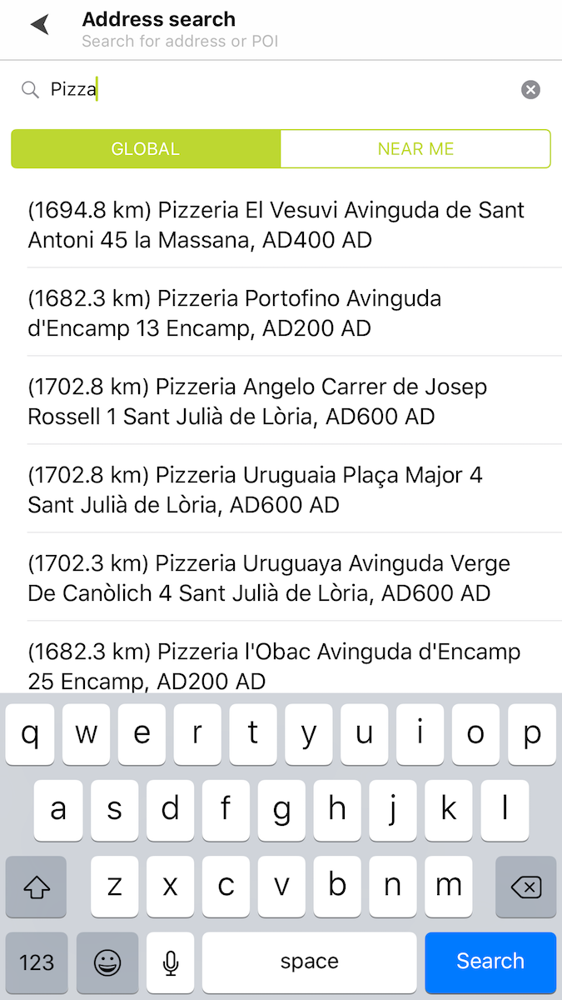
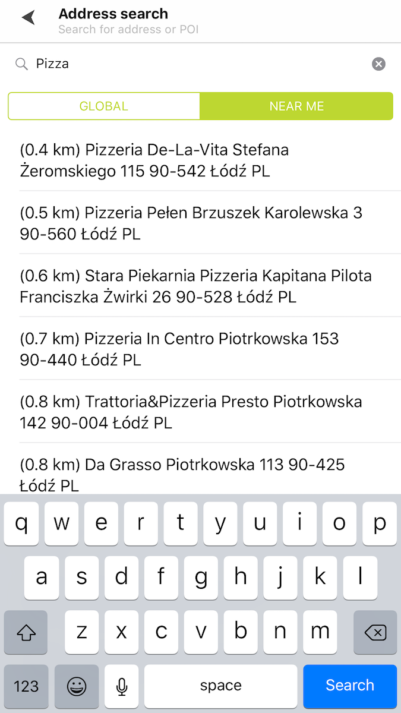

<a
  href="#"
  style={{ display: 'block', margin: '0', padding: '0' }}
  name="address-search"
></a>

Allow your users to easily search for addresses and POIs (Points of Interest) in a single step.
Implement global search or near-me search in your mobile app so that it returns the best search
results for your needs. Global search uses the search functionality’s default settings. It doesn’t
use the user’s position or other search parameters. A sample use case: You use an app to search for
a place. This search should not be limited in any way.

Use the following code snippet in your app to list general search results or display them on the
map.

<Code>

```swift
let query = TTSearchQueryBuilder.create(withTerm: term)
    .build()
search.search(with: query)
```

```objectivec
TTSearchQuery *query = [[TTSearchQueryBuilder createWithTerm:term] build]
[self.search searchWithQuery:query];
```

</Code>

Add the following code snippet to your app to get search results that are geo-biased for a given
location in a range specified by a radius.

<Code>

```swift
let query = TTSearchQueryBuilder.create(withTerm: term)
    .withPosition(coordinate)
    .build()
search.search(with: query)
```

```objectivec
TTSearchQuery *query = [[[TTSearchQueryBuilder createWithTerm:term] withPosition:coordinate] build];
[self.search searchWithQuery:query];
```

</Code>

<table>
  <tbody>
    <tr>
      <td>
        <ContentWrapper maxWidth="350px" objectFit="contain">
          <p>
            
          </p>
        </ContentWrapper>
        <p>Global address search</p>
      </td>
      <td>
        <ContentWrapper maxWidth="350px" objectFit="contain">
          <p>
            
          </p>
        </ContentWrapper>
        <p>Near me address search</p>
      </td>
    </tr>
  </tbody>
</table>