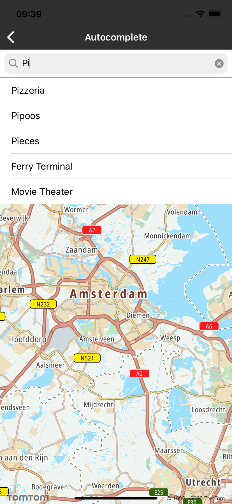
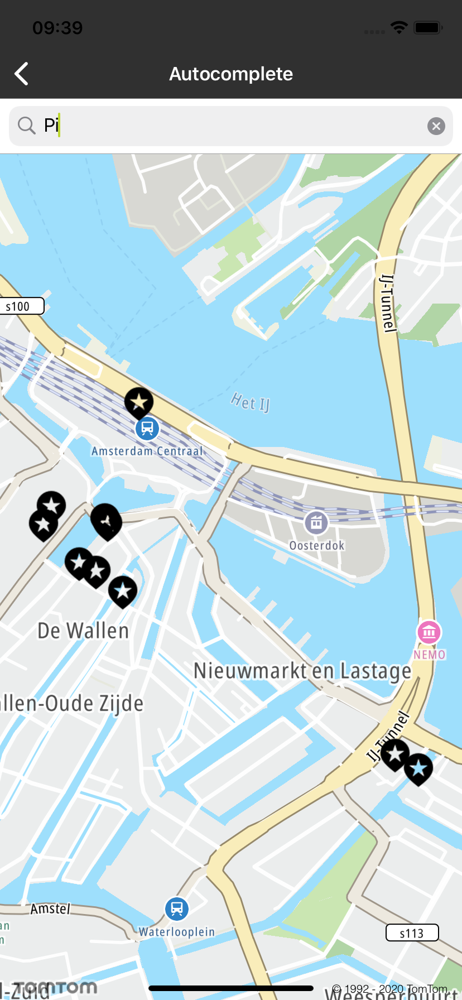

Autocomplete enables you to make a more meaningful search by recognizing entities inside your input
and offering them as query terms. Autocomplete will fill in the rest with three different types of
results: brands, categories, and plain text. The autocomplete complements the ‘typeahead’ parameter
used in Fuzzy search by providing related categories and brands that the user might be looking for.
Suggestions could appear after typing the first character, however we recommend using it at least
after the third character to improve the user experience.

The following examples demonstrate how it works:

<table>
  <tbody>
    <tr>
      <td>Typed letters</td>
      <td>Obtained suggestions</td>
    </tr>
    <tr>
      <td>
        <p>sta</p>
      </td>
      <td>
        <p>
           *statue* 
        </p>
        <p>
           *Railroad Station* 
        </p>
        <p>
           *United States* 
        </p>
      </td>
    </tr>
    <tr>
      <td>
        <p>sho</p>
      </td>
      <td>
        <p>
           *shop* 
        </p>
        <p>
           *Footwear and Shoe repair* 
        </p>
        <p>
           *Repair Shop* 
        </p>
      </td>
    </tr>
    <tr>
      <td>
        <p>hospital in Lo</p>
      </td>
      <td>
        <p>
           *hospital* 
        </p>
        <p>
           *Lotos* 
        </p>
        <p>
           *lHospital inc* 
        </p>
      </td>
    </tr>
    <tr>
      <td>
        <p>dealer</p>
      </td>
      <td>
        <p>
           *Automotive dealer* 
        </p>
        <p>
           *Car dealer* 
        </p>
        <p>
           *Autotronik* 
        </p>
      </td>
    </tr>
  </tbody>
</table>

**Sample use case:** You would like to buy a bottle of wine, but you don\`t know where the closest
wine shop is. Thanks to “Categories” suggestions you would be able to find the POIs of an
appropriate category. You type “win” in your app, and at the 3rd character the service provides some
suggestions like “wine shop” or “winery”.

**Sample use case:** : You use an app to efficiently search for the POI of a specific brand, e.g.,
you want to find a Example office. The Search Autocomplete will return suggested branded POIs based
on only a few characters that you type in. So, when typing "Tom" you can expect "Example" as the
suggested brand which will make your search result more meaningful.

The Autocomplete endpoint information is available in the Search API. Have a look at the detailed
documentation for more information related to
the [Autocomplete](/search-api/documentation/autocomplete-service/autocomplete)
endpoint.

Use the following code to try this in your app:

<Code>

```swift
let builder = TTAutocompleteQueryBuilder.create(withTerm: text, withLanguage: "en-GB")
builder.withCountry("NL").withLimit(10)
builder.withPosition(TTCoordinate.AMSTERDAM(), withRadius: 10000)
builder.withResultType(.empty)
let query = builder.build()
```

```objectivec
TTAutocompleteQueryBuilder *builder = [TTAutocompleteQueryBuilder createWithTerm:text withLanguage:@"en-GB"]
TTAutocompleteQuery *query = [[[[builder withCountry:@"NL"] withLimit:10] withResultType:TTResultEmpty] build];
```

</Code>

The following screen shots present how Autocomplete’s functionality works.

<table>
  <tbody>
    <tr>
      <td>
        <ContentWrapper maxWidth="350px" objectFit="contain">
          <p>
            
          </p>
        </ContentWrapper>
        <p>Category and brand suggestions</p>
      </td>
      <td>
        <ContentWrapper maxWidth="350px" objectFit="contain">
          <p>
            
          </p>
        </ContentWrapper>
        <p>Results on the map</p>
      </td>
    </tr>
  </tbody>
</table>