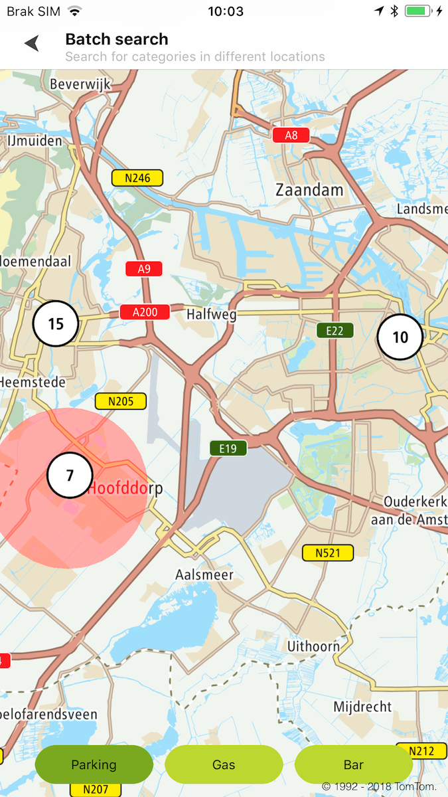

Allow your users to process synchronous Batch Search calls with
the [Batch Search](/search-api/documentation/batch-search-service/batch-search-service)
service being integrated. When the service receives a Request, it will respond as soon as the batch
items are calculated and there will be no possibility to retrieve the results later on.

<a
  href="#"
  style={{ display: 'block', margin: '0', padding: '0' }}
  name="_supported_types_of_requests"
></a>

## Supported types of requests

Different types of requests can be mixed in one Batch Request. The information about the limit of
queries, request processing time, and other details are described in
the [Batch Search](/search-api/documentation/batch-search-service/batch-search-service)
service documentation. An error in one of the Batch Requests causes the whole batch to fail.

**Sample use case:** You want to simultaneously search for different categories within different
locations.

Use the following code to try this in your app:

<Code>

```swift
let query1 = TTSearchQueryBuilder.create(withTerm: term)
    .withCategory(true)
    .withPosition(TTCoordinate.AMSTERDAM_CENTER_LOCATION())
    .withLimit(10)
    .build()
let query2 = TTSearchQueryBuilder.create(withTerm: term)
    .withCategory(true)
    .withPosition(TTCoordinate.HAARLEM())
    .withLimit(15)
    .build()
let geometry = TTSearchCircle(center: TTCoordinate.HOOFDDORP(), radius: 4000)
let geometryQuery = TTGeometrySearchQueryBuilder.create(withTerm: term, searchShapes: [geometry])
    .build()
let batchQuery = TTBatchQueryBuilder.createSearchQuery(query1)
    .add(query2)
    .addGeometryQuery(geometryQuery)
    .build()
batchSearch.batchSearch(with: batchQuery)
```

```objectivec
TTSearchQuery *query1 = [[[[[TTSearchQueryBuilder createWithTerm:term] withCategory:YES] withPosition:[TTCoordinate AMSTERDAM_CENTER_LOCATION]] withLimit:10] build]
TTSearchQuery *query2 = [[[[[TTSearchQueryBuilder createWithTerm:term] withCategory:YES] withPosition:[TTCoordinate HAARLEM]] withLimit:15] build];
TTSearchCircle *geometry = [TTSearchCircle circleWithCenter:[TTCoordinate HOOFDDORP] radius:4000];
TTGeometrySearchQuery *geometryQuery = [[TTGeometrySearchQueryBuilder createWithTerm:term searchShapes:@[ geometry ]] build];
TTBatchQuery *batchQuery = [[[[TTBatchQueryBuilder createSearchQuery:query1] addSearchQuery:query2] addGeometryQuery:geometryQuery] build];
[self.batchSearch batchSearchWithQuery:batchQuery];
```

</Code>

Sample views utilizing data retrieved using the Batch Search service:

<table>
  <tbody>
    <tr>
      <td>
        <ContentWrapper maxWidth="350px" objectFit="contain">
          <p>
            
          </p>
        </ContentWrapper>
        <p>Search results for different locations</p>
      </td>
    </tr>
  </tbody>
</table>