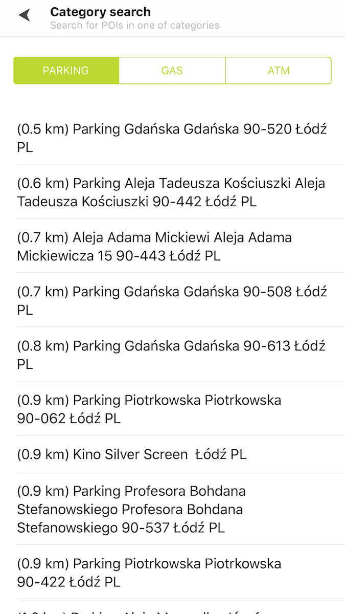
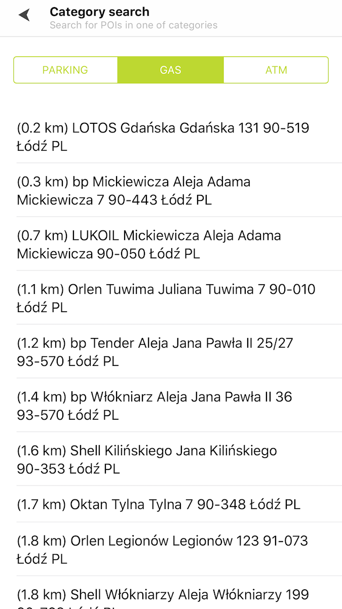

Help your users search for specific types of places with Category Search. Sample use case: You are
preparing for a long drive and would like to find nearby gas stations.

Use the following code snippet to try this in your app.

<Code>

```swift
let query = TTSearchQueryBuilder.create(withTerm: "parking")
    .withCategory(true)
    .withPosition(locationManager.lastLocation!.coordinate)
    .build()
search.search(with: query)
```

```objectivec
TTSearchQuery *query = [[[[TTSearchQueryBuilder createWithTerm:@"parking"] withCategory:YES] withPosition:self.locationManager.lastLocation.coordinate] build]
[self.search searchWithQuery:query];
```

</Code>

For Category Search we use LowBandwidthSearch as in "Address and POI search". The difference is in
the endpoint:

<table>
  <tbody>
    <tr>
      <td>
        <p>Category search</p>
      </td>
      <td>
        <p>
          GET
          https://&lt;baseURL&gt;/search/&lt;versionNumber&gt;/cS/&lt;category&gt;...
        </p>
      </td>
    </tr>
  </tbody>
</table>

For a complete description go to: [https://developer.Example.com/search-api/documentation/search-service/low-bandwidth-search](https://developer.Example.com/search-api/documentation/search-service/low-bandwidth-search)

The following code example presents an exemplary application view utilizing Category Search.

<table>
  <tbody>
    <tr>
      <td>
        <ContentWrapper maxWidth="350px" objectFit="contain">
          <p>
            
          </p>
        </ContentWrapper>
        <p>Address search with category: Parking</p>
      </td>
      <td>
        <ContentWrapper maxWidth="350px" objectFit="contain">
          <p>
            
          </p>
        </ContentWrapper>
        <p>Address search with category: Gas</p>
      </td>
    </tr>
  </tbody>
</table>