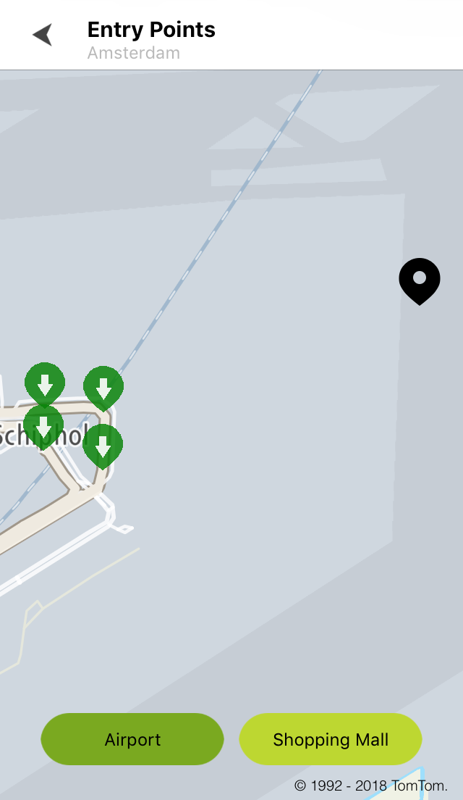
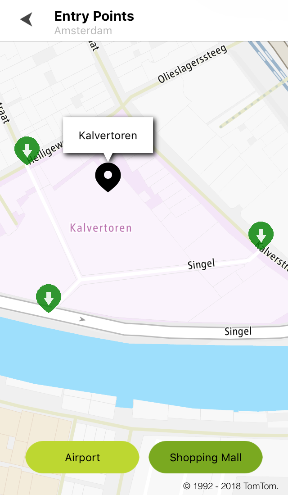

Allow your users to display entry points using fuzzy search results.

**Sample use case:** A taxi driver wants to pick up a passenger from a specific entry point at the
airport.

Use the following code to try this in your app:

```swift
for entryPoint in entryPoints {
    let annotation = CustomAnnotation(coordinate: entryPoint.position,
                                      annotationImage: TTAnnotationImage.createPNG(withName: "entry_point")!,
                                      anchor: TTAnnotationAnchor.bottom,
                                      type: TTAnnotationType.focal)
    annotation.title = "Entry point type: \(entryPoint.type!)"
```

        mapView.annotationManager.add(annotation)
    }
    mapView.zoomToAllAnnotations()

```objectivec
for (TTEntryPoint *entryPoint in entryPoints) {
    CustomAnnotation *annotation = [[CustomAnnotation alloc] initWithCoordinate:entryPoint.position annotationImage:[TTAnnotationImage createPNGWithName:@"entry_point"] anchor:TTAnnotationAnchorBottom type:TTAnnotationTypeFocal]
```

        annotation.title = [NSString stringWithFormat:@"Entry point type %@", entryPoint.type];
        [self.mapView.annotationManager addAnnotation:annotation];
    }
    [self.mapView zoomToAllAnnotations];

Sample views utilizing entry points:

<table>
  <tbody>
    <tr>
      <td>
        <ContentWrapper maxWidth="350px" objectFit="contain">
          <p>
            
          </p>
        </ContentWrapper>
        <p>Entry points for the Amsterdam airport</p>
      </td>
      <td>
        <ContentWrapper maxWidth="350px" objectFit="contain">
          <p>
            
          </p>
        </ContentWrapper>
        <p>Entry points for the Kalvertoren mall</p>
      </td>
    </tr>
  </tbody>
</table>