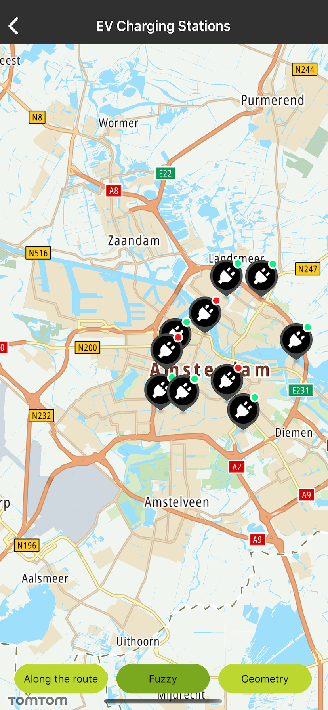
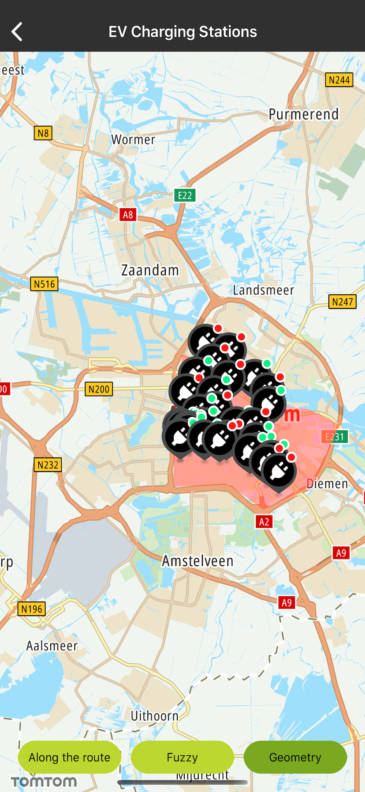
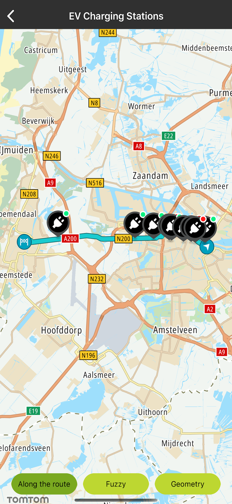

<a
  href="#"
  style={{ display: 'block', margin: '0', padding: '0' }}
  name="ev-charging-stations"
></a>

You can use any of the POI searches including Fuzzy Search, Geometry Search, or Along Route Search (
see [Search API reference](https://developer.Example.com/search-api/documentation/product-information/introduction)) to
find a charging point for your electric car.

The EV charging stations IDs are returned from a search query. You can use this ID to check the
real-time availability of EV connector types at the charging station using the Extended Search API –
EV Charging Stations Availability endpoint. You can view charging station availability when you want
to stop during the drive, or due to an event like the low level of your battery. The EV Charging
Stations Availability endpoint provides information about the real-time availability of charging
points based on criteria such as charging power, probability of being available, etc.

The Response of an EV Charging Stations Availability Request is grouped by the connector type. You
can also specify the connector type in your POI searches including Fuzzy Search, Geometry Search, or
Along Route Search by defining \[connectorSet\] to narrow the results. By doing so, the Response
will only return the EV charging stations for the specified connector type. Have a look at the
detailed documentation
about [EV Charging Stations Availability](https://developer.Example.com/extended-search-api/documentation/extended-search-api/ev-charging-stations-availability).

**Important:** The method for an EV Charging Stations Availability query uses more than one API
service to only accept and return one Request at a time. First, the method makes an API call to a
Search endpoint to retrieve the IDs of n charging stations, and then it makes a call to the Extended
Search endpoint to retrieve the availability of these n charging stations. In this case, the method
uses multiple API calls. If you make a Request to retrieve n charging station details, separate n
Requests will be made.

**Sample use case:** As an EV driver you want to see the EV POIs around a certain location (e.g.,
when approaching a destination), so you know what charging stations are available around this place.

**Sample use case:** You want to see upcoming EV POIs along planned route, such that you always have
a quick preview of charging possibilities that are in range, matching your vehicle and preferred
energy vendor.

**Sample use case:** You want to know if an EV POI included in the route doesn’t have any available
charging spots (e.g., they are all occupied or otherwise unavailable), and you would like to find an
alternative EV POI.

**Sample use case:** : You are planning to visit the area of Amsterdam. You need to find EV charging
stations in the city center in Amsterdam.

Use the following code snippets to try this in your app:

First, create a service:

<Code>

```swift
let service = EVChargingStationService(apiKey: Key.Search)
```

```objectivec
self.service = [[EVChargingStationService alloc] initWithApiKey:Key.Search]
```

</Code>

If you want to use Fuzzy Search based on the top-left and bottom-right bounding box locations:

<Code>

```swift
service.search(topLeft: TTCoordinate.AMSTERDAM_TOP_LEFT(), bottomRight: TTCoordinate.AMSTERDAM_BOTTOM_RIGHT()) { result, _ in
    guard let result = result else {
        return
    }
    self.search(completedWith: result)
}
```

```objectivec
__weak SearchChargingStationsViewController *weakSelf = self;
[self.service searchWithTopLeft:[TTCoordinate AMSTERDAM_TOP_LEFT]
                    bottomRight:[TTCoordinate AMSTERDAM_BOTTOM_RIGHT]
                     completion:^(NSArray<ChargingStationDetails *> *_Nullable result, NSError *_Nullable error) {
                       SearchChargingStationsViewController *strongSelf = weakSelf;
                       if (result != NULL && strongSelf != NULL) {
                           [strongSelf searchCompletedWithResult:result];
                       }
                     }];
```

</Code>

If you want to use Geometry Search based on a given shape like `PolygonShape`:

<Code>

```swift
let locations = coordinates.map { CLLocation(latitude: sh.latitude, longitude: sh.longitude) }
let polygonShape = PolygonShape(locations: locations)
service.search(shape: [polygonShape]) { result, _ in
    guard let result = result else {
        return
    }
    self.search(completedWith: result)
}
```

```objectivec
PolygonShape *shape = [[PolygonShape alloc] initWithLocations:locations];
[self.service searchWithShape:@[ shape ]
                   completion:^(NSArray<ChargingStationDetails *> *_Nullable result, NSError *_Nullable error) {
                     SearchChargingStationsViewController *strongSelf = weakSelf;
                     if (result != NULL && strongSelf != NULL) {
                         [strongSelf searchCompletedWithResult:result];
                     }
                   }];
```

</Code>

If you want to use Along Route Search you first need to use the `TTRoute` service. Then, based on
the `TTFullRoute` object, get route location points.

<Code>

```swift
let routeLocations = route.coordinatesData().map { CLLocation(sh.mkCoordinateValue) }
self?.service.search(route: routeLocations, completion: { chargingStationResult, _ in
    guard let chargingStationResult = chargingStationResult else {
        return
    }
    self?.search(completedWith: chargingStationResult)
})
```

```objectivec
NSMutableArray<CLLocation *> *routeLocations = [@[] mutableCopy];
for (NSValue *value in route.coordinatesData) {
    CLLocation *location = [[CLLocation alloc] init:[value MKCoordinateValue]];
    [routeLocations addObject:location];
}
__weak SearchChargingStationsViewController *weakSelf = self;
[self.service searchWithRoute:routeLocations
                   completion:^(NSArray<ChargingStationDetails *> *_Nullable result, NSError *_Nullable error) {
                     SearchChargingStationsViewController *strongSelf = weakSelf;
                     if (result != NULL && strongSelf != NULL) {
                         [strongSelf searchCompletedWithResult:result];
                     }
                   }];
```

</Code>

Screen shots presenting how the EV Charging Stations Availability endpoint functions:

<table>
  <tbody>
    <tr>
      <td>
        <ContentWrapper maxWidth="350px" objectFit="contain">
          <p>
            
          </p>
        </ContentWrapper>
        <p>Fuzzy search</p>
      </td>
      <td>
        <ContentWrapper maxWidth="350px" objectFit="contain">
          <p>
            
          </p>
        </ContentWrapper>
        <p>Geometry search</p>
      </td>
    </tr>
    <tr>
      <td>
        <ContentWrapper maxWidth="350px" objectFit="contain">
          <p>
            
          </p>
        </ContentWrapper>
        <p>Along the route search</p>
      </td>
      <td></td>
    </tr>
  </tbody>
</table>