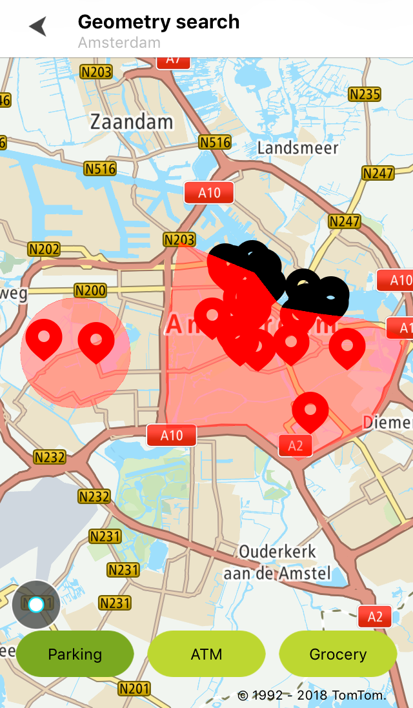
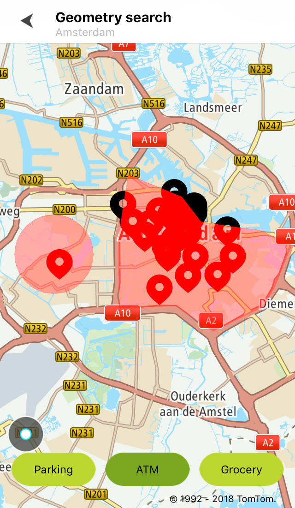

Allow your users to perform a free text search inside geometries specified by circlers and/or
polygons.

**Sample use case:** You are planing to visit the area of Amsterdam. You need to find a parking
spot, an ATM, and a grocery store in the Amsterdam city center and/or in the west part of the city.

Use the following code snippet to code this in your app:

<Code>

```swift
let query = TTGeometrySearchQueryBuilder.create(withTerm: "Parking", searchShapes: geometryShape)
    .withLimit(30)
    .build()
geometrySearch.search(with: query)
```

```objectivec
TTGeometrySearchQuery *query = [[[TTGeometrySearchQueryBuilder createWithTerm:@"Parking" searchShapes:self.geometryShape] withLimit:30] build]
[self.geometrySearch searchWithQuery:query];
```

</Code>

The following code example presents an exemplary application that shows Geometry Search.

<table>
  <tbody>
    <tr>
      <td>
        <ContentWrapper maxWidth="350px" objectFit="contain">
          <p>
            
          </p>
        </ContentWrapper>
        <p>Geometry search with the term: Parking</p>
      </td>
      <td>
        <ContentWrapper maxWidth="350px" objectFit="contain">
          <p>
            
          </p>
        </ContentWrapper>
        <p>Geometry search with the term: ATM</p>
      </td>
    </tr>
  </tbody>
</table>