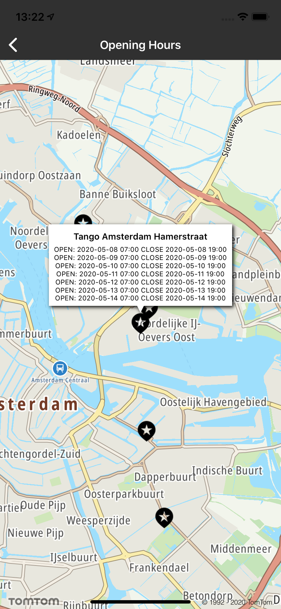

<a
  href="#"
  style={{ display: 'block', margin: '0', padding: '0' }}
  name="opening-hours-search"
></a>

Represents information on when a POI will be open during the next 7 days, starting with the current
day in the local time of the POI. It returns a list of strings that represent opening and closing
hours in a given
format: [Response body](/search-api/documentation/search-service/points-of-interest-search)

**Sample use case 1:** You are searching for a specific store to visit but you don\`t know if it is
currently open. Through your app you query opening shop times and the store working hours are
displayed on the screen.

**Sample use case 2:** A company is collating a report about closing hours in a given city area for
grocery shops. Using the SDK services all grocery’s shops in a given radius can be queried for
closing hours, allowing for statistical analysis and other studies.

The opening hours data are available in the Search API.

Have a look at the detailed documentation for more information related to
the [POI search](/search-api/documentation/search-service/points-of-interest-search)
and [Fuzzy search](/search-api/documentation/search-service/fuzzy-search)

That parameter will be used for services where POIs are exposed, including:

- categorySearch
- searchAlongRoute
- geometrySearch
- fuzzySearch

Include "withOpeningHours" in query builder as shown in the code snippet below.

<Code>

```swift
let query = TTSearchQueryBuilder.create(withTerm: "Petrol station")
    .withPosition(TTCoordinate.AMSTERDAM())
    .withLang("en-GB")
    .withOpeningHours(.nextSevenDays)
    .build()
```

```objectivec
TTSearchQuery *query = [[[[[TTSearchQueryBuilder createWithTerm:@"Petrol station"] withPosition:[TTCoordinate AMSTERDAM]] withLang:@"en-GB"] withOpeningHours:TTOpeningHoursNextSevenDays] build]
```

</Code>

Screenshots:

<ContentWrapper maxWidth="350px" objectFit="contain">



</ContentWrapper>