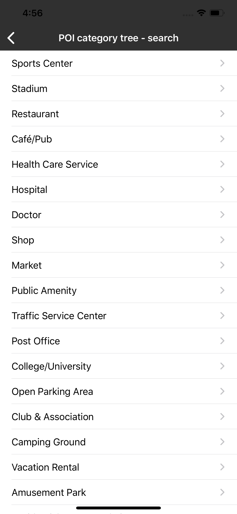

<a
  href="#"
  style={{ display: 'block', margin: '0', padding: '0' }}
  name="poi-categories"
></a>

The POI Categories service endpoint provides the full list of POI categories and subcategories
together with their translations and synonyms available in Search API,
see [POI Categories](/search-api/documentation/poi-categories-service/poi-categories-service)
for more information.

Thanks to that list, you do not have to hardcode categories in your app, as they change dynamically.
Once you have the POI category ID, you can use them as a filter (categorySet) in search quires.

Sample use case: You want to display a dynamic list of all available categories and subcategories
that can be used for search combined with appropriate filters.

Use the code snippet below in your app to get list of categories.

<Code>

```swift
let query = TTPoiCategoriesQueryBuilder.create().build()
poiCategoriesService.request(with: query)
```

```objectivec
TTPoiCategoriesQuery *query = [[TTPoiCategoriesQueryBuilder create] build]
[_poiCategoriesService requestCategoriesWithQuery:query];
```

</Code>

<table>
  <tbody>
    <tr>
      <td>
        <ContentWrapper maxWidth="350px" objectFit="contain">
          <p>
            
          </p>
        </ContentWrapper>
        <p>List of categories.</p>
      </td>
      <td></td>
    </tr>
  </tbody>
</table>