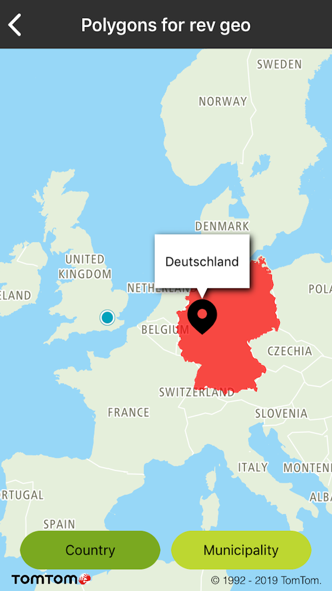
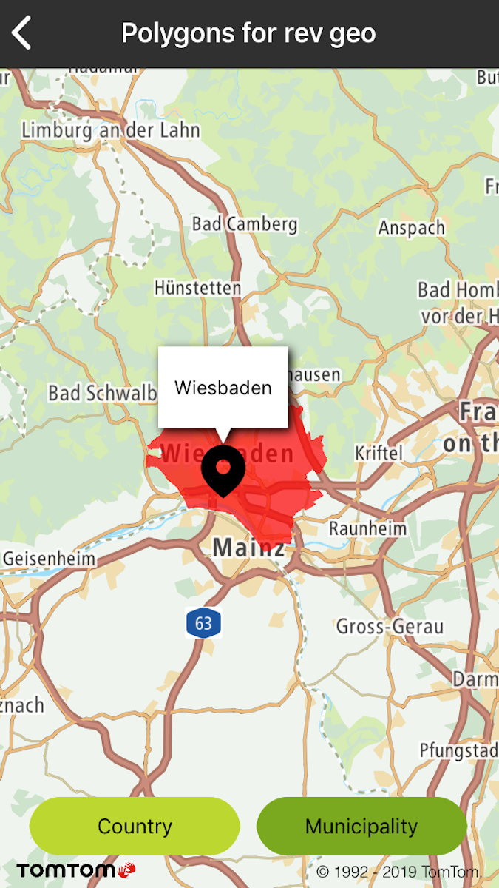

Combine Additional Data Provider queries with Reverse Geocoding queries to obtain extra data about a
specific [entity Type](/search-api/documentation/reverse-geocoding-service/reverse-geocoding-service)
like:

- Country
- CountrySubdivision
- CountrySecondarySubdivision
- CountryTertiarySubdivision
- Municipality
- MunicipalitySubdivision
- Neighbourhood
- PostalCodeArea

**Sample use case:** You want to display Country or Municipality boundaries.

Use the following code to try this in your app:

Create **TTReverseGeocoderQuery** with the entityType parameter and use Reverse Geocode search.

<Code>

```swift
let query = TTReverseGeocoderQueryBuilder.create(with: coordinate).withEntityType(entityType)
    .build()
reverseGeocoder.reverseGeocoder(with: query)
```

```objectivec
TTReverseGeocoderQuery *query = [[[TTReverseGeocoderQueryBuilder createWithCLLocationCoordinate2D:coordinate] withEntityType:self.entityType] build]
[self.reverseGeocoder reverseGeocoderWithQuery:query];
```

</Code>

Get the **TTGeometryDataSource** object from the Response.

<Code>

```swift
guard let address = response.result.addresses.first else { return }
guard let additionalDataSources = address.additionalDataSources else { return }
guard let geometryDataSource = additionalDataSources.geometryDataSource else { return }
```

```objectivec
- (TTGeometryDataSource *_Nullable)geometryDataSourceFromResponse:(TTReverseGeocoderResponse *)response {
    if (response.result.addresses.firstObject != nil) {
        TTReverseGeocoderFullAddress *addressValue = [TTReverseGeocoderFullAddress alloc];
        addressValue = response.result.addresses.firstObject;
        if (addressValue.additionalDataSources) {
            TTAdditionalDataSources *additionalDataSources = [TTAdditionalDataSources alloc];
            additionalDataSources = addressValue.additionalDataSources;
            if (additionalDataSources.geometryDataSource) {
                return additionalDataSources.geometryDataSource;
            }
        }
    }
    return nil;
}
```

</Code>

Use the **TTAdditionalDataSearchQuery** object for sending Requests with the **
TTGeometryDataSource** object supported by the Additional Data API.

```swift
let query = TTAdditionalDataSearchQueryBuilder.create(with: geometryDataSource)
    .withGeometriesZoom(geometriesZoom)
    .build()
```

    searchAdditionalData.additionalDataSearch(with: query)

```objectivec
if ([self geometryDataSourceFromResponse:response] != nil) {
    TTAdditionalDataSearchQuery *query = [[[TTAdditionalDataSearchQueryBuilder createWithDataSource:[self geometryDataSourceFromResponse:response]] withGeometriesZoom:geometriesZoom] build];
    [_searchAdditionalData additionalDataSearchWithQuery:query];
}
```

Sample views utilizing entities retrieved by combining both services:

<table>
  <tbody>
    <tr>
      <td>
        <ContentWrapper maxWidth="350px" objectFit="contain">
          <p>
            
          </p>
        </ContentWrapper>
        <p>Boundaries for a selected country</p>
      </td>
      <td>
        <ContentWrapper maxWidth="350px" objectFit="contain">
          <p>
            
          </p>
        </ContentWrapper>
        <p>Boundaries for a selected municipality</p>
      </td>
    </tr>
  </tbody>
</table>