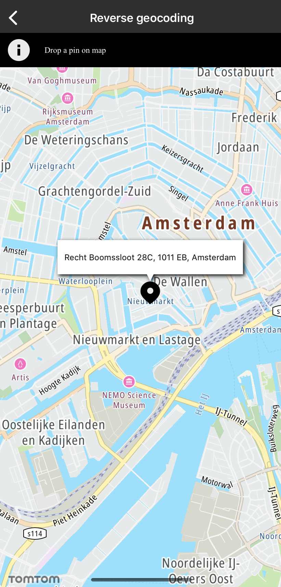

Sometimes you need to translate a coordinate into a human-readable street address. This is often
used in tracking applications that receive a GPS feed from a device or asset and need to obtain the
corresponding address. The Reverse Geocoding endpoint returns the address information described in
the Reverse Geocoding API documentation on the Developer Portal. Sample use case: You want to know
the address of a place on the map. You press your finger on the map display and address information
appears in a balloon on the screen.

Use the following code to try this in your app:

<Code>

```swift
let query = TTReverseGeocoderQueryBuilder.create(with: coordinate)
    .build()
reverseGeocoder.reverseGeocoder(with: query)
```

```objectivec
TTReverseGeocoderQuery *query = [[TTReverseGeocoderQueryBuilder createWithCLLocationCoordinate2D:coordinate] build]
[self.reverseGeocoder reverseGeocoderWithQuery:query];
```

</Code>

<table>
  <tbody>
    <tr>
      <td>
        <ContentWrapper maxWidth="350px" objectFit="contain">
          <p>
            
          </p>
        </ContentWrapper>
        <p>Reverse geocoder</p>
      </td>
    </tr>
    <tr>
      <td></td>
    </tr>
  </tbody>
</table>