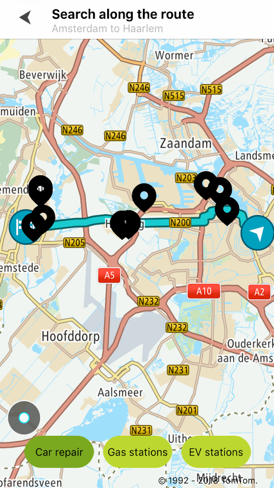
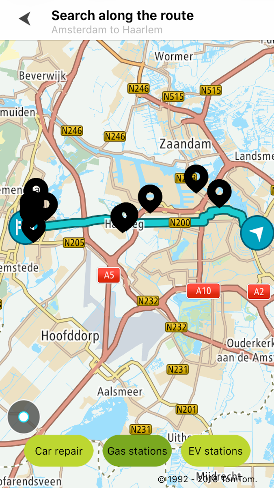
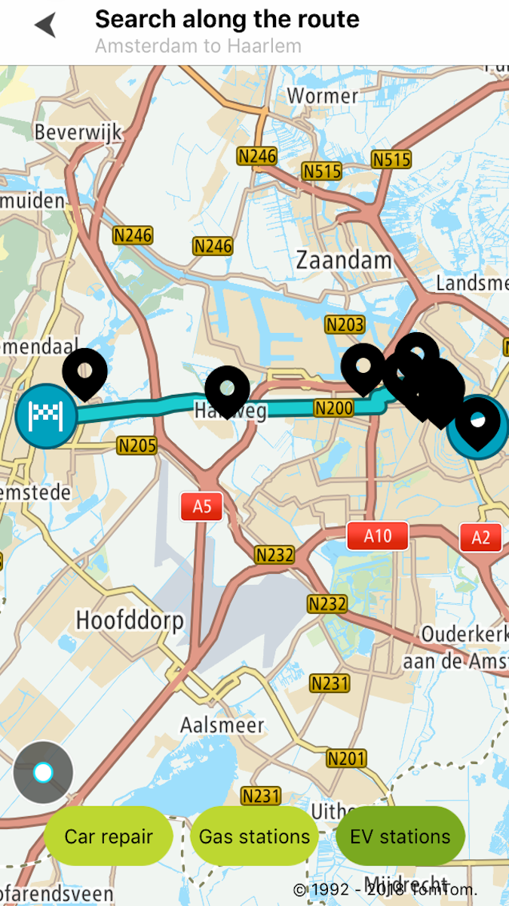

Allow your users to search for POIs along a planned route so they can optimally add places to their
rides. The Along Route Search endpoint allows you to perform a fuzzy search for POIs along a
specified route. This search is constrained by specifying the detour time and limiting the number of
results. The minimum number of route points is 2.

**Sample use case 1:** You are driving from Amsterdam to Haarlem and you would like to find a
gasoline/petrol station or EV station to fuel or charge your car during your drive. **Sample use
case 2:** Planning your next trip you would like add a car repair station so you can fix something
in your vehicle to drive safely.

Use the following code to display 10 POIs along a route with a maximum detour time of 900 sec:

<Code>

```swift
let query = TTAlongRouteSearchQueryBuilder(term: "REPAIR_FACILITY", withRoute: mapRoute, withMaxDetourTime: 900)
    .withLimit(10)
    .build()
alongRouteSearch.search(with: query)
```

```objectivec
TTAlongRouteSearchQuery *query = [[[TTAlongRouteSearchQueryBuilder withTerm:@"REPAIR_FACILITY" withRoute:self.mapRoute withMaxDetourTime:900] withLimit:10] build]
[self.alongRouteSearch searchWithQuery:query];
```

</Code>

<table>
  <tbody>
    <tr>
      <td>
        <ContentWrapper maxWidth="350px" objectFit="contain">
          <p>
            
          </p>
        </ContentWrapper>
        <p>With term "REPAIR_FACILITY"</p>
      </td>
      <td>
        <ContentWrapper maxWidth="350px" objectFit="contain">
          <p>
            
          </p>
        </ContentWrapper>
        <p>With term "PETROL_STATION"</p>
      </td>
    </tr>
    <tr>
      <td>
        <ContentWrapper maxWidth="350px" objectFit="contain">
          <p>
            
          </p>
        </ContentWrapper>
        <p>With term "ELECTRIC_VEHICLE_STATION"</p>
      </td>
      <td></td>
    </tr>
  </tbody>
</table>