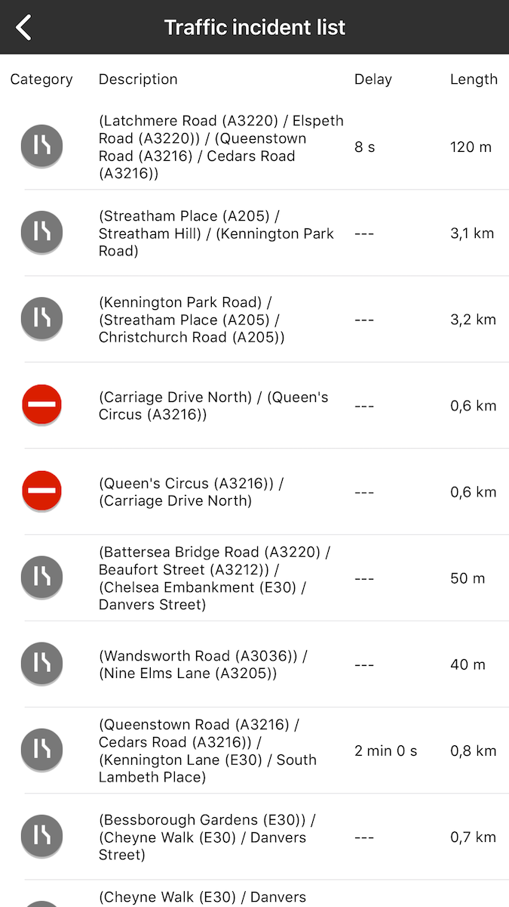
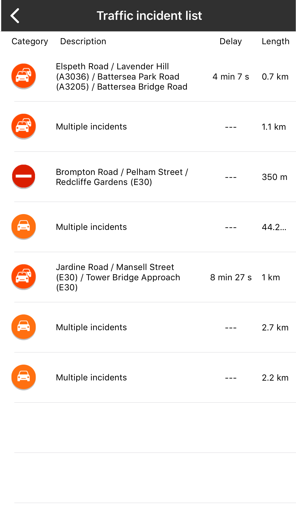

<a
  href="#"
  style={{ display: 'block', margin: '0', padding: '0' }}
  name="address-traffic"
></a>

Give your users information about traffic incidents so they can adjust their commute according to
the traffic situation.

Sample use case: You are about to drive and you want to avoid roads with traffic incidents on your
way. Use the traffic incident list to have the overview of which streets might be blocked or
congested due to accidents, road works, or possible rain, ice, flooding, etc.

Use the following code snippet to try this in your app.

<Code>

```swift
let bounds = TTLatLngBoundsMake(TTCoordinate.LONDON_TOP_LEFT(), TTCoordinate.LONDON_BOTTOM_RIGHT())
let query = TTIncidentDetailsQueryBuilder.create(with: .S1, withBoundingBox: bounds, withZoom: 12, withTrafficModelID: "-1")
    .build()
```

```objectivec
TTLatLngBounds bounds = TTLatLngBoundsMake([TTCoordinate LONDON_TOP_LEFT], [TTCoordinate LONDON_BOTTOM_RIGHT])
TTIncidentDetailsQuery *query = [[TTIncidentDetailsQueryBuilder createWithStyle:TTTrafficIncidentStyleTypeS1 withBoundingBox:bounds withZoom:12 withTrafficModelID:@"-1"] build];
```

</Code>

An example implementation of the callback of the Response from the Traffic Incident Details service:

<Code>

```swift
func incidentDetails(_: TTTrafficIncidents, completedWith response: TTIncidentDetailsResponse) {
    progress.hide()
    displayResults(response.incidents)
}
```

```objectivec
- (void)incidentDetails:(TTTrafficIncidents *)trafficIncidents completedWithResponse:(TTIncidentDetailsResponse *)response {
    [self.progress hide];
    [self displayResults:response.incidents];
}
```

</Code>

<table>
  <tbody>
    <tr>
      <td>
        <ContentWrapper maxWidth="350px" objectFit="contain">
          <p>
            
          </p>
        </ContentWrapper>
        <p>Incidents list</p>
      </td>
      <td>
        <ContentWrapper maxWidth="350px" objectFit="contain">
          <p>
            
          </p>
        </ContentWrapper>
        <p>Incidents list with clusters</p>
      </td>
    </tr>
  </tbody>
</table>