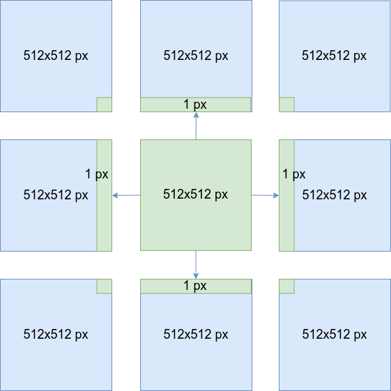
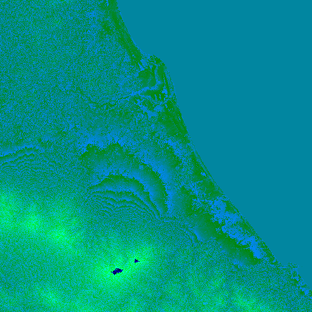

## Purpose  

The Maps Raster Hillshade Tile API endpoint provides terrain elevation data that is divided into gridded sections called tiles. It can be used for rendering hillshade that shows the topographical shape of hills and mountains.
Tiles are square images with a size of: <b>514 x 514 pixels</b>. The tiles are available at 14 different zoom levels, ranging from 0 to 13. See the: <a href="/map-display-api/documentation/zoom-levels-and-tile-grid" target="_blank">Zoom Levels and Tile Grid</a>.


### Tile image format

The Maps Raster Tile API Hillshade service supports the <b>png</b> format.

### Overlay

The overlay can be applied to the Maps Raster Hillshade Tiles using <a href="https://developer.tomtom.com/map-display-api/documentation/mapstyles/map-styles" target="_blank">Map Styles</a>.

### Tile Sizes

* **514 x 514 pixels** Each tile includes a 1-pixel buffer around the edges, taken from neighbor tiles.




### Elevation data

Every pixel in the tile combines 3 colors: red, green, and blue. It contains an elevation value(in meters), which can be decoded with the formula:

``` [title=Decoding elevation value]
height = -10000 + ((Red * 256 * 256 + Green * 256 + Blue) * 0.1)
```

Example:
For pixel `rgb(1, 134, 170)` which have color values:
* Red: **1**
* Green: **134**
* Blue: **170**

Using it with formula:

```
height = -10000 + ((1 * 256 * 256 + 134 * 256 + 170) * 0.1)
```

This equation gives us an elevation value equal to `1` meter above sea level.


### Run this endpoint

You can easily run this and other endpoints. Go to the TomTom <a href="/map-display-api/api-explorer/">API Explorer</a> page and follow the directions.


## Request data

### HTTPS method: `GET`

* Constants and parameters enclosed in curly brackets &#123; &#125; **must be replaced** with their values.
* Please see the following [Request parameters](#request-parameters) section with the required and optional parameters tables for their values. The generic request format is as follows.

<h4 style="font-size:1em;">URL format</h4>

```markdown [type=get] [title=Request URL]
https://{baseURL}/map/{versionNumber}/tile/{layer}/{type}/{zoom}/{X}/{Y}.{format}?key={Your_API_Key}
```

<h4 style="font-size:1em;">Example</h4>

```markdown [type=get] [title=Request example]
https://api.tomtom.com/map/1/tile/hill/main/8/68/120.png?key={Your_API_Key}
```

<h4 style="font-size:1em;">curl command format</h4>

```markdown [type=get] [title=Request curl command]
curl 'https://{baseURL}/map/{versionNumber}/tile/{layer}/{type}/{zoom}/{X}/{Y}.{format}?key={Your_API_Key}
```


### Request parameters

These parameters are used in calls to generate all tile layers.

* Required parameters **must be used** or the call will fail.
* Parameters and values are case-sensitive.
* Optional parameters may be used.

<table>
  <thead>
    <tr>
      <th scope="col" style={{ fontSize: '1em' }} width="250px">
        Required parameters
      </th>
      <th scope="col" style={{ fontSize: '1em' }}>
        Description
      </th>
    </tr>
  </thead>
  <tbody>
    <tr>
      <th scope="row">
         `baseURL`
        <br />
         *string*
      </th>
      <td>
        The base URL for calling TomTom services.
        <br />
         **Value:**  `api.tomtom.com`
      </td>
    </tr>
    <tr>
      <th scope="row">
         `versionNumber`
        <br />
         *string*
      </th>
      <td>
        The version of the service to call.
        <br />
         **Value:**  The current version is  `1`.
      </td>
    </tr>
    <tr>
      <th scope="row">
         `layer`
        <br />
         *string*
      </th>
      <td>
        Layer of the tile to be requested.
        <br />
         **Value:**  `hill`
      </td>
    </tr>
    <tr>
      <th scope="row">
         `type`
        <br />
         *string*
      </th>
      <td>
        Type of the tile to be requested.
        <br />
         **Value:**  `main`
      </td>
    </tr>
    <tr>
      <th scope="row">
         `zoom`
        <br />
         *integer*
      </th>
      <td>
        Zoom level of the tile to be rendered.
        <br />
         **Value:**   `0..13`
      </td>
    </tr>
    <tr>
      <th scope="row">
         `X`
        <br />
         *integer*
      </th>
      <td>
        The x coordinate of the tile on a zoom grid.
        <br />
         **Value:**
         0..2  <sup>zoom</sup> -1
      </td>
    </tr>
    <tr>
      <th scope="row">
         `Y`
        <br />
         *integer*
      </th>
      <td>
        The y coordinate of the tile on a zoom grid.
        <br />
         **Value:**
         0..2  <sup>zoom</sup> -1
      </td>
    </tr>
    <tr></tr>
    <tr>
      <th scope="row">
         `format`
        <br />
         *string*
      </th>
      <td>
        The format of the response.
        <br />
         **Value:**   `png`
      </td>
    </tr>
    <tr>
      <th scope="row">
         `key`
        <br />
         *string*
      </th>
      <td>
        An API Key valid for the requested service.
        <br />
         **Value:**  Your valid API Key.
      </td>
    </tr>
  </tbody>
</table>


### Request headers

The following table lists HTTP request headers of particular interest to clients of the Maps Raster Tile API Hillshade endpoint.

<table>
  <thead>
    <tr>
      <th scope="col" style={{ fontSize: '1em' }} width="250px;">
        Optional&nbsp;headers
      </th>
      <th scope="col" style={{ fontSize: '1em' }}>
        Description
      </th>
    </tr>
  </thead>
  <tbody>
    <tr>
      <th scope="row">
         [Accept-Encoding](https://developer.mozilla.org/en-US/docs/Web/HTTP/Headers/Accept-Encoding)
      </th>
      <td>
        Contains the content encoding (usually a compression algorithm), that
        the client is able to understand.
        <br />
         **Value:**   `gzip`
      </td>
    </tr>
    <tr>
      <th scope="row">
         [If-None-Match](https://developer.mozilla.org/en-US/docs/Web/HTTP/Headers/If-None-Match)
      </th>
      <td>
        Contains an identifier for a specific version of resource. The server
        will send back the requested resource, with a 200 HTTP status code, only
        if it doesn't have an ETag matching the given one.
        <br />
         **Value:**   `<string>`
      </td>
    </tr>
    <tr>
      <th id="trackingid-request" scope="row">
        Tracking-ID
      </th>
      <td>
        Specifies an identifier for the request. It can be used to trace a call.
        The value must match the regular expression
         `'^[a-zA-Z0-9-]{1,100}'`. An example of the format
        that matches this regular expression is a UUID (e.g.,
         `9ac68072-c7a4-11e8-a8d5-f2801f1b9fd1` ). For details check
         [RFC 4122](https://tools.ietf.org/html/rfc4122). If specified, it is replicated in the
         [Tracking-ID](#trackingid-response)  response header.
        <br />
         **Value:**   `<string>`
      </td>
    </tr>
  </tbody>
</table>

## Response data

The Maps Raster Hillshade Tile API, for a single request, *returns one square tile* in **png** format.

### Response examples

<h4 style={{ fontSize: '1em', marginTop: '1em' }}>
  Example 1: Zoom =  `8`
</h4>

<table style={{ marginTop: '1em' }}>
  <thead>
    <tr>
      <th scope="col">
        Request (Zoom =  `8` )
      </th>
      <th scope="col" style={{ width: '29em' }}>
        Response (Zoom =  `8` )
      </th>
    </tr>
  </thead>
  <tbody>
    <tr>
      <th scope="row">
         `https://api.tomtom.com/map/1/tile/hill/main/8/68/120.png?key={Your_API_Key}`
      </th>
      <td>
        
      </td>
    </tr>
  </tbody>
</table>

<h4 style={{ fontSize: '1em', marginTop: '1em' }}>
  Example 2: Zoom =  `13`
</h4>

<table style={{ marginTop: '1em' }}>
  <thead>
    <tr>
      <th scope="col">
        Request (Zoom =  `13` )
      </th>
      <th scope="col" style={{ width: '29em' }}>
        Response (Zoom =  `13` )
      </th>
    </tr>
  </thead>
  <tbody>
    <tr>
      <th scope="row">
         `https://api.tomtom.com/map/1/tile/hill/main/13/2196/3879.png?key={Your_API_Key}`
      </th>
      <td>
        
      </td>
    </tr>
  </tbody>
</table>

### Error response

The Maps Raster Tile API Hillshade service for an invalid request returns a response body in XML or JSON format. The XML format is returned by default. To have an error response returned in JSON format,  `application/json`  has to be specified in the  `Accept`  HTTP request header.

<h4 style={{ fontSize: '1em' }}>Error response field structure</h4>

<table>
  <thead>
    <tr>
      <th scope="col" style={{ fontSize: '1em' }} width="250px;">
        Field
      </th>
      <th scope="col" style={{ fontSize: '1em' }}>
        Description
      </th>
    </tr>
  </thead>
  <tbody>
    <tr>
      <th scope="row">
         `detailedError`
        <br />
         *object*
      </th>
      <td>Main object of the error response.</td>
    </tr>
    <tr>
      <th scope="row">
         `code`
        <br />
         *string*
      </th>
      <td>One of a server-defined set of error codes.</td>
    </tr>
    <tr>
      <th scope="row">
         `message`
        <br />
         *string*
      </th>
      <td>A human-readable description of the error code.</td>
    </tr>
  </tbody>
</table>


### Error response example

```json [title=Error response example - JSON]
{
  "detailedError" : {
    "code" : "BAD_REQUEST",
    "message" : "Invalid tile position arguments"
  }
}
```

```xml [title=Error response example - XML]
<errorResponse description="Invalid tile position arguments" errorCode="400" version="1.0.54-mascoma">
    <code>BAD_REQUEST</code>
    <message>Invalid tile position arguments</message>
  </detailedError>
</errorResponse>
```

### Response codes

<table>
  <thead>
    <tr>
      <th scope="col" width="250px;" style={{ textAlign: 'center', fontSize: '1em' }}>
        Code
      </th>
      <th scope="col" style={{ textAlign: 'center' }}>
        Meaning &amp; possible causes
      </th>
    </tr>
  </thead>
  <tbody>
    <tr>
      <th scope="row" style={{ textAlign: 'center' }}>
         `200`
      </th>
      <td>
         **OK**
      </td>
    </tr>
    <tr>
      <th scope="row" style={{ textAlign: 'center' }}>
         `304`
      </th>
      <td>
         **Not Modified** : The tile has not been modified. This code is
        returned when the  `If-None-Match`  request header is used and
        its value matches the ETag of the requested tile.
      </td>
    </tr>
    <tr>
      <th scope="row" style={{ textAlign: 'center' }}>
         `400`
      </th>
      <td>
         **Bad request** : Probably malformed syntax.
        <ul>
          <li>Invalid format value.</li>
          <li>
            Zoom  *n*  is out of range 0 &lt;= zoom &lt;= 13: The requested
            zoom level is out of the possible range.
          </li>
          <li>
            x  *n*  is out of range [0, *m* ]: The requested x coordinate
            is out of the possible range (the value of  *m*  will vary
            depending on the zoom level).
          </li>
          <li>
            y  *n*  is out of range [0, *m* ]: The requested y coordinate
            is out of the possible range (the value of  *m*  will vary
            depending on the zoom level).
          </li>
        </ul>
      </td>
    </tr>
    <tr>
      <th scope="row" style={{ textAlign: 'center' }}>
         `403`
      </th>
      <td>
         **Forbidden** :
        <ul>
          <li>The supplied API Key is not valid for this request.</li>
        </ul>
      </td>
    </tr>
    <tr>
      <th scope="row" style={{ textAlign: 'center' }}>
         `429`
      </th>
      <td>
         **Too Many Requests** : Too many requests were sent in a given amount
        of time for the supplied API Key.
      </td>
    </tr>
    <tr>
      <th scope="row" style={{ textAlign: 'center' }}>
         `500`
      </th>
      <td>
         **Internal Server Error** : There is a problem with the TomTom Maps Hillshade Tile API service.
      </td>
    </tr>
    <tr>
      <th scope="row" style={{ textAlign: 'center' }}>
         `503`
      </th>
      <td>
         **Service is currently unavailable**.
      </td>
    </tr>
  </tbody>
</table>

### HTTP response headers

The following table lists HTTP response headers of particular interest to clients of the Maps Raster Tile API Hillshade endpoint.

<table>
  <thead>
    <tr>
      <th scope="col" style={{ fontSize: '1em' }} width="250px;">
        Header
      </th>
      <th scope="col" style={{ fontSize: '1em' }}>
        Description
      </th>
    </tr>
  </thead>
  <tbody>
    <tr>
      <th scope="row">
         [Access-Control-Allow-Origin](https://developer.mozilla.org/en/docs/HTTP/Access_control_CORS#Access-Control-Allow-Origin) 
      </th>
      <td>
        The Maps Raster Tile API allows cross-origin resource sharing (CORS).
        <br />
         **Value:**   `*`
      </td>
    </tr>
    <tr>
      <th scope="row">
         [Cache-Control](https://developer.mozilla.org/en-US/docs/Web/HTTP/Headers/Cache-Control)
      </th>
      <td>
        Contains directives for a caching mechanism.
        <br />
         **Value:**   `max-age=<decimal number>`
      </td>
    </tr>
    <tr>
      <th scope="row">
         [Content-Encoding](https://developer.mozilla.org/en-US/docs/Web/HTTP/Headers/Content-Encoding)
      </th>
      <td>
        Indicates which encodings were applied to the response body.
        <br />
         **Value:**   `gzip`
      </td>
    </tr>
    <tr>
      <th scope="row">
         [Content-Length](https://developer.mozilla.org/en-US/docs/Web/HTTP/Headers/Content-Length)
      </th>
      <td>
        Contains information about the size of the response body.
        <br />
         **Value:**   `<decimal number>`
      </td>
    </tr>
    <tr>
      <th scope="row">
         [Content-Type](https://developer.mozilla.org/en-US/docs/Web/HTTP/Headers/Content-Type) 
      </th>
      <td>
        Indicates the media type of the resource returned.
        <br />
         **Value:**   `image/png`
      </td>
    </tr>
    <tr>
      <th scope="row">
         [Date](https://developer.mozilla.org/en-US/docs/Web/HTTP/Headers/Date)
      </th>
      <td>
        Contains the date and time at which the message was originated.
        <br />
         **Value:**   `<http-date>`
      </td>
    </tr>
    <tr>
      <th scope="row">
         [ETag](https://developer.mozilla.org/en-US/docs/Web/HTTP/Headers/ETag)
      </th>
      <td>
        Contains an identifier for a specific version of resource.
        <br />
         **Value:**   `"<hexadecimal number>"`
      </td>
    </tr>
    <tr>
      <th scope="row">
         [Expires](https://developer.mozilla.org/en/docs/Web/HTTP/Headers/Expires)
      </th>
      <td>
        Contains the date after which the response is considered outdated.
        <br />
         **Value:**   `http-date`
      </td>
    </tr>
    <tr>
      <th scope="row">
         [Transfer-Encoding](https://developer.mozilla.org/en-US/docs/Web/HTTP/Headers/Transfer-Encoding)
      </th>
      <td>
        Specifies the form of encoding used to safely transfer the response to
        the user. If this header is specified, the Content-Length header will be
        absent.
        <br />
         **Value:**   `chunked`
      </td>
    </tr>
    <tr>
      <th id="trackingid-response" scope="row">
        Tracking-ID
      </th>
      <td>
        An identifier for the request. If the
         [Tracking-ID](#trackingid-request)  header was specified in
        the request, it is replicated in the response. Otherwise, it is
        automatically generated by the service. For details check
         [RFC 4122](https://tools.ietf.org/html/rfc4122).<br />
         **Value:**   `<string>`
      </td>
    </tr>
  </tbody>
</table>