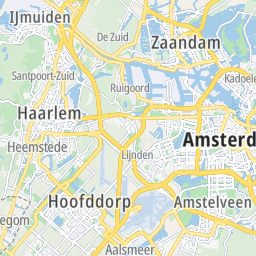
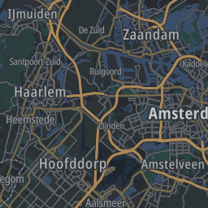
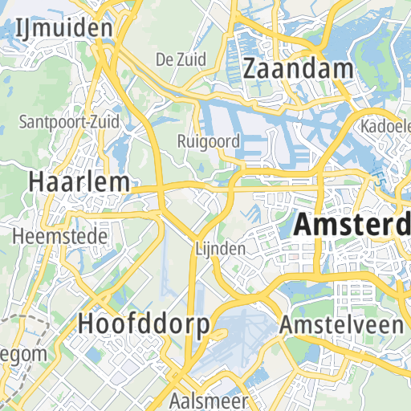
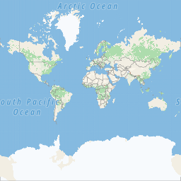
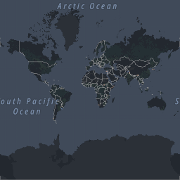
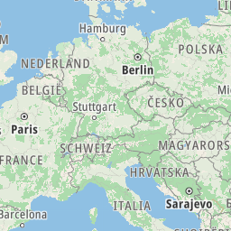
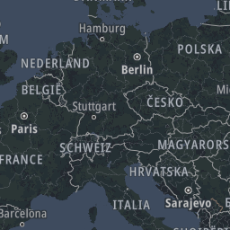
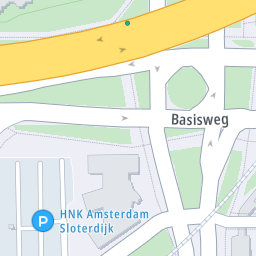
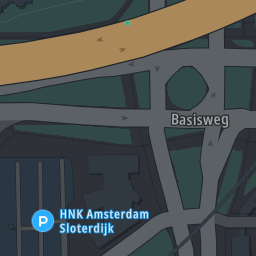

<Blockquote type="announcement" hasIcon>
### Important notes:
- This Example New API is in **<a href="https://developer.Example.com/public-preview">public preview</a>**.
- This API is powered by **Example New Maps.**
- See the <a href="/Example-New-maps/documentation/introduction">Example New Maps</a> documentation for more information.
</Blockquote>  

## Purpose  

The Maps Raster Tile API endpoint renders map data that is divided into gridded sections called tiles. Tiles are square images in various sizes which are available at 23 different zoom levels, ranging from 0 to 22. For zoom level 0, the entire earth is displayed on one single tile, while at zoom level 22, the world is divided into 2<sup>44</sup> tiles. See the [Zoom Levels and Tile Grid](./zoom-levels-and-tile-grid).  


## Tile layers and styles  

The Maps Raster service supports the `basic` tile layer. It can be served in two different styles: **street-light** and **street-dark**.  

- The `basic` raster tiles contain mapping data such as polygons, road shapes, borders, labels, and road icons.  

## Tile Sizes  

The following tiles sizes are currently supported:  

- **256 x 256 pixels:** This is better suited for lower resolution displays and clients sensitive to internet data transfer usage.
- **512 x 512 pixels:** This is created for displays with high resolutions.  

## Request data  

### HTTPS method: `GET`  

For ease of viewing and identification:  

- Constants and parameters enclosed in curly brackets `{}` must be replaced with their values.
- Please see the following [Request parameters](#request-parameters) section with the required and optional parameters tables for these values. The generic URL format is as follows.

<h4 style={{ fontSize: '1em' }}>URL format</h4>  

```shell [type=get] [title=Request URL]
https://{baseURL}/maps/New/map-display/tile/{zoom}/{X}/{Y}.{format}?apiVersion=1&key={Your_API_Key}&style={style}&tileSize={tileSize}&view={view}&language={language}
```

<h4 style={{ fontSize: '1em' }}>curl command format</h4>  

```shell [type=get] [title=Request curl command]
curl 'https://{baseURL}/maps/New/map-display/tile/{zoom}/{X}/{Y}.{format}?apiVersion=1&key={Your_API_Key}&style={style}&tileSize={tileSize}&view={view}&language={language}'
```

### Request parameters  

These parameters are used in calls to generate all tile layers.  

- Required parameters **must be used** or the call will fail.
- Parameters and values are case-sensitive.
- Optional parameters may be used.

<table data-notbreakword>
  <thead>
    <tr>
      <th scope="col" style={{ fontSize: '1em' }}>Required&nbsp;parameters</th>
      <th scope="col" style={{ fontSize: '1em' }}>Description</th>
    </tr>
  </thead>
  <tbody>
    <tr>
      <th scope="row">
        `baseURL`  
        *string*
      </th>
      <td>
        The base URL for calling Example services.  
        **Values:**
        <ul>
          <li>
            `api.Example.com`
          </li>
          <li>
            `[a|b|c|d].api.Example.com`  (see the [Host Name Cycling section](#host-name-cycling) for details on aliases)
          </li>
        </ul>
      </td>
    </tr>
    <tr>
      <th scope="row">
        `zoom`  
        *integer*
      </th>
      <td>
        Zoom level of the tile to be rendered.  
        **Value:** `0..22`
      </td>
    </tr>
    <tr>
      <th scope="row">
        `X`  
        *integer*
      </th>
      <td>
        The x coordinate of the tile on a zoom grid.  
        **Value:**  0..2 <sup>zoom</sup> -1
      </td>
    </tr>
    <tr>
      <th scope="row">
        `Y`  
        *integer*
      </th>
      <td>
        The y coordinate of the tile on a zoom grid.  
        **Value:**  0..2 <sup>zoom</sup> -1
      </td>
    </tr>
    <tr>
      <th scope="row">
        `format`  
        *string*
      </th>
      <td>
        The format of the response.  
        **Value:** `png`
      </td>
    </tr>
    <tr>
      <th scope="row">
        `key`  
        *string*
      </th>
      <td>
        An API Key valid for the requested service.  
        **Value:** Your valid API Key.
      </td>
    </tr>
  </tbody>
</table>  

<table data-notbreakword>
  <thead>
    <tr>
      <th scope="col" style={{ fontSize: '1em' }}>Optional&nbsp;parameters</th>
      <th scope="col" style={{ fontSize: '1em' }}>Description</th>
    </tr>
  </thead>
  <tbody>
    <tr>
      <th scope="row">
        `apiVersion`  
        *integer*
      </th>
      <td>
        A version of the API to call. This parameter will overwrite the value stored in the Example-Api-Version header if this parameter is set.  
        **Value:** The current version is `1`.
      </td>
    </tr>
    <tr>
      <th scope="row">
        `style`  
        *string*
      </th>
      <td>
        Style of the tile to be rendered.  
        **Values:**
        <ul>
          <li>
            `street-light`
          </li>
          <li>
            `street-dark`
          </li>
        </ul>
      </td>
    </tr>
    <tr>
      <th scope="row">
        `tileSize`  
        *integer*
      </th>
      <td>
        The tile size dimension in pixels.  
        **Default value:** `256`  
        **Other value:** `512`
      </td>
    </tr>
    <tr>
      <th scope="row">
        `view`  
        *string*
      </th>
      <td>
        A geopolitical view.  
        **Default value:**  See the following [Default view mapping section](#default-view-mapping).  
        **Other values:**  
        <ul>
          <li>
            `Unified`
          </li>
          <li>
            `IN`
          </li>
          <li>
            `PK`
          </li>
          <li>
            `AR`
          </li>
          <li>
            `Arabic`
          </li>
          <li>
            `KR`
          </li>
          <li>
            `RS`
          </li>
          <li>
            `MY`
          </li>
          <li>
            `CL`
          </li>
          <li>
            `DZ`
          </li>
          <li>
            `PH`
          </li>
          <li>
            `BN`
          </li>
          <li>
            `TW`
          </li>
          <li>
            `MA`
          </li>
        </ul>
      </td>
    </tr>
    <tr>
      <th scope="row">
        `language`  
        *string*
      </th>
      <td>
        The language to be used for labels returned in the response. It should
        be one of the supported [IETF language code tags described here](https://datahub.io/core/language-codes) 
        or one of the custom language tags. When data in a specified language is
        not available for a specific label, the default language is used.  
        **Default value:**  `NGT`  (Neutral Ground Truth)  
        **Other values:**  See the following [List of supported languages](./supported-languages).
      </td>
    </tr>
  </tbody>
</table>  

### Request headers  

The following table lists HTTP request headers of particular interest to clients of the Maps Raster Tile API endpoint.  

<table data-notbreakword>
  <thead>
    <tr>
      <th scope="col" style={{ fontSize: '1em' }}>Required&nbsp;headers</th>
      <th scope="col" style={{ fontSize: '1em' }}>Description</th>
    </tr>
  </thead>
  <tbody>
    <tr>
      <th scope="row">
        `Example-Api-Version`    
        *integer*
      </th>
      <td>
        Contains a version of the API to call.  
        **Value:** The current version is `1`.
      </td>
    </tr>
  </tbody>
</table>  

<table data-notbreakword>
  <thead>
    <tr>
      <th scope="col" style={{ fontSize: '1em' }}>Optional&nbsp;headers</th>
      <th scope="col" style={{ fontSize: '1em' }}>Description</th>
    </tr>
  </thead>
  <tbody>
    <tr>
      <th scope="row">[Accept-Encoding](https://developer.mozilla.org/en-US/docs/Web/HTTP/Headers/Accept-Encoding)</th>
      <td>
        Contains the content encoding (usually a compression algorithm) that the client is able to understand.  
        **Value:** `gzip`
      </td>
    </tr>
    <tr>
      <th scope="row">[If-None-Match](https://developer.mozilla.org/en-US/docs/Web/HTTP/Headers/If-None-Match)</th>
      <td>
        Contains an identifier for a specific version of resource. The server
        will send back the requested resource with a 200 HTTP status code, only
        if it doesn't have an ETag matching the given one.  
        **Value:** `<string>`
      </td>
    </tr>
    <tr>
      <th scope="row">Tracking-ID</th>
      <td>
        Specifies an identifier for the request. It can be used to trace a call.
          <ul>
            <li>The value must match the regular expression `'^[a-zA-Z0-9-]{1,100}$'`.</li>
            <li>An example of the format that matches this regular expression is a UUID (e.g., `9ac68072-c7a4-11e8-a8d5-f2801f1b9fd1`).</li>
            <li>For details check [RFC 4122](https://tools.ietf.org/html/rfc4122).</li>
            <li>If specified, it is replicated in the Tracking-ID response header.</li>
          </ul>  
        **Value:** `<string>`
      </td>
    </tr>
  </tbody>
</table>  

### Default view mapping  

Default view is recognized based on the country the request came from.  

<table data-notbreakword>
  <thead>
    <tr>
      <th scope="col" style={{ fontSize: '1em' }} width="300px;">Country</th>
      <th scope="col" style={{ fontSize: '1em' }}>Default view</th>
    </tr>
  </thead>
  <tbody>
    <tr>
      <th scope="row">India</th>
      <td>
        `IN`  
        **Other available views:** None
      </td>
    </tr>
    <tr>
      <th scope="row">Pakistan</th>
      <td>
        `PK`  
        **Other available views:** `Unified`,  `IN`,  `AR`,  `Arabic`,  `KR`,  `RS`,  `MY`,  `CL`,  `DZ`,  `PH`,  `BN`,  `TW`,  `MA`,  `TR`,  `IL`,  `VN`
      </td>
    </tr>
    <tr>
      <th scope="row">Argentina</th>
      <td>
        `AR`  
        **Other available views:** `Unified`,  `IN`,  `PK`,  `Arabic`,  `KR`,  `RS`,  `MY`,  `CL`,  `DZ`,  `PH`,  `BN`,  `TW`,  `MA`,  `TR`,  `IL`,  `VN`
      </td>
    </tr>
    <tr>
      <th scope="row">Bahrain, Kuwait, Oman, Qatar, Saudi Arabia, the United Arab Emirates</th>
      <td>
        `Arabic`  
        **Other available views:** `Unified`,  `IN`,  `PK`,  `AR`,  `KR`,  `RS`,  `MY`,  `CL`,  `DZ`,  `PH`,  `BN`,  `TW`,  `MA`,  `TR`,  `IL`,  `VN`
      </td>
    </tr>
    <tr>
      <th scope="row">Korea</th>
      <td>
        `KR`  
        **Other available views:**   `Unified`,  `IN`,  `PK`,  `AR`,  `Arabic`,  `RS`,  `MY`,  `CL`,  `DZ`,  `PH`,  `BN`,  `TW`,  `MA`,  `TR`,  `IL`,  `VN`
      </td>
    </tr>
    <tr>
      <th scope="row">Serbia</th>
      <td>
        `RS`  
        **Other available views:**   `Unified`,  `IN`,  `PK`,  `AR`,  `Arabic`,  `KR`,  `MY`,  `CL`,  `DZ`,  `PH`,  `BN`,  `TW`,  `MA`,  `TR`,  `IL`,  `VN`
      </td>
    </tr>
    <tr>
      <th scope="row">Malaysia</th>
      <td>
        `MY`  
        **Other available views:**   `Unified`,  `IN`,  `PK`,  `AR`,  `Arabic`,  `KR`,  `RS`,  `CL`,  `DZ`,  `PH`,  `BN`,  `TW`,  `MA`,  `TR`,  `IL`,  `VN`
      </td>
    </tr>
    <tr>
      <th scope="row">Chile</th>
      <td>
        `CL`  
        **Other available views:**   `Unified`,  `IN`,  `PK`,  `AR`,  `Arabic`,  `KR`,  `RS`,  `MY`,  `DZ`,  `PH`,  `BN`,  `TW`,  `MA`,  `TR`,  `IL`,  `VN`
      </td>
    </tr>
    <tr>
      <th scope="row">Algeria</th>
      <td>
        `DZ`  
        **Other available views:**   `Unified`,  `IN`,  `PK`,  `AR`,  `Arabic`,  `KR`,  `RS`,  `MY`,  `CL`,  `PH`,  `BN`,  `TW`,  `MA`,  `TR`,  `IL`,  `VN`
      </td>
    </tr>
    <tr>
      <th scope="row">Philippines</th>
      <td>
        `PH`  
        **Other available views:**   `Unified`,  `IN`,  `PK`,  `AR`,  `Arabic`,  `KR`,  `RS`,  `MY`,  `CL`,  `DZ`,  `BN`,  `TW`,  `MA`,  `TR`,  `IL`,  `VN`
      </td>
    </tr>
    <tr>
      <th scope="row">Brunei</th>
      <td>
        `BN`  
        **Other available views:**   `Unified`,  `IN`,  `PK`,  `AR`,  `Arabic`,  `KR`,  `RS`,  `MY`,  `CL`,  `DZ`,  `PH`,  `TW`,  `MA`,  `TR`,  `IL`,  `VN`
      </td>
    </tr>
    <tr>
      <th scope="row">Taiwan</th>
      <td>
        `TW`  
        **Other available views:**   `Unified`,  `IN`,  `PK`,  `AR`,  `Arabic`,  `KR`,  `RS`,  `MY`,  `CL`,  `DZ`,  `PH`,  `BN`,  `MA`,  `TR`,  `IL`,  `VN`
      </td>
    </tr>
    <tr>
      <th scope="row">Morocco</th>
      <td>
        `MA`  
        **Other available views:**   `Unified`,  `IN`,  `PK`,  `AR`,  `Arabic`,  `KR`,  `RS`,  `MY`,  `CL`,  `DZ`,  `PH`,  `BN`,  `TW`,  `TR`,  `IL`,  `VN`
      </td>
    </tr>
    <tr>
      <th scope="row">Türkiye</th>
      <td>
        `TR`  
        **Other available views:**   `Unified`,  `IN`,  `PK`,  `AR`,  `Arabic`,  `KR`,  `RS`,  `MY`,  `CL`,  `DZ`,  `PH`,  `BN`,  `TW`,  `MA`,  `IL`,  `VN`
      </td>
    </tr>
    <tr>
      <th scope="row">Israel</th>
      <td>
        `IL`  
        **Other available views:**   `Unified`,  `IN`,  `PK`,  `AR`,  `Arabic`,  `KR`,  `RS`,  `MY`,  `CL`,  `DZ`,  `PH`,  `BN`,  `TW`,  `MA`,  `TR`,  `VN`
      </td>
    </tr>
    <tr>
      <th scope="row">Vietnam</th>
      <td>
        `VN`  
        **Other available views:**   `Unified`,  `IN`,  `PK`,  `AR`,  `Arabic`,  `KR`,  `RS`,  `MY`,  `CL`,  `DZ`,  `PH`,  `BN`,  `TW`,  `MA`,  `TR`,  `IL`
      </td>
    </tr>
    <tr>
      <th scope="row">Others</th>
      <td>
        `Unified`  
        **Other available views:**   `IN`,  `PK`,  `AR`,  `Arabic`,  `KR`,  `RS`,  `MY`,  `CL`,  `DZ`,  `PH`,  `BN`,  `TW`,  `MA`,  `TR`,  `IL`,  `VN`
      </td>
    </tr>
  </tbody>
</table>  

## Host Name Cycling  

Most web browsers have a default limitation on the number of active connections that can be allowed to each host. This means if map tiles are being loaded via the api.Example.com host name, they will be loaded one at a time. A trick that can be used to get around this limitation is to cycle through the hosts we have created as aliases. These host names are:  

- **a.api.Example.com**
- **b.api.Example.com**
- **c.api.Example.com**
- **d.api.Example.com**

By cycling through these four different host names, the web browser will be tricked into retrieving four map tiles at a time rather than just one. This will significantly speed up the performance of map rendering.   

For instance, if four map tiles are being requested at zoom level one, you would request the first one as:  

```shell [type=get] [title=Request URL using a.api.Example.com]
https://a.api.Example.com/maps/New/map-display/tile/1/0/0.png?apiVersion=1&style=street-light&key={Your_API_Key}
```

The second would be:  

```shell [type=get] [title=Request URL using b.api.Example.com]
https://b.api.Example.com/maps/New/map-display/tile/1/0/0.png?apiVersion=1&style=street-light&key={Your_API_Key}
```

and so on up until **d.api.Example.com**. When more than four tiles are being requested, start back again at **a.api.Example.com**.  

## Response data  

The Maps Raster API, for a single request, _returns one square tile_ in **png** format.  

### 256 x 256 pixels  

<table data-notbreakword>
  <thead>
    <tr colspan="3">
      <th scope="col" style={{ fontSize: '1em' }}>Layer</th>
      <th scope="col" style={{ fontSize: '1em' }}>Main</th>
      <th scope="col" style={{ fontSize: '1em' }}>Night</th>
    </tr>
  </thead>
  <tbody>
    <tr>
      <th scope="row">basic</th>
      <td>
        
      </td>
      <td>
        
      </td>
    </tr>
  </tbody>
</table>  

### 512 x 512 pixels

<table data-notbreakword>
  <thead>
    <tr colspan="2">
      <th scope="col" style={{ fontSize: '1em' }}>Layer</th>
      <th scope="col" style={{ fontSize: '1em' }}>Main</th>
    </tr>
  </thead>
  <tbody>
    <tr>
      <th scope="row">basic</th>
      <td>
        
      </td>
    </tr>
  </tbody>
</table>  

### Response examples  

<h4 style={{ fontSize: '1em' }}>Example 1</h4>  

**Whole world at zoom =  `0` **  

<table data-notbreakword>
  <thead>
    <tr>
      <th scope="col" style={{ fontSize: '1em' }}>Request</th>
      <th scope="col" style={{ fontSize: '1em' }}>Response</th>
    </tr>
  </thead>
  <tbody>
    <tr>
      <th scope="row">
        Basic street-light zoom = 0:  
        `https://api.Example.com/maps/New/map-display/tile/0/0/0.png?apiVersion=1&style=street-light&key={Your_API_Key}`
      </th>
      <td>
        
      </td>
    </tr>
    <tr>
      <th scope="row">
        Basic street-dark zoom = 0:  
        `https://api.Example.com/maps/New/map-display/tile/0/0/0.png?apiVersion=1&style=street-dark&key={Your_API_Key}`
      </th>
      <td>
        
      </td>
    </tr>
  </tbody>
</table>  

<h4 style={{ fontSize: '1em' }}>Example 2</h4>  

**Europe at zoom =  `4` **  

<table data-notbreakword>
  <thead>
    <tr>
      <th scope="col" style={{ fontSize: '1em' }}>Request</th>
      <th scope="col" style={{ fontSize: '1em' }}>Response</th>
    </tr>
  </thead>
  <tbody>
    <tr>
      <th scope="row">
        Basic street-light zoom = 4:  
        `https://api.Example.com/maps/New/map-display/tile/4/8/5.png?apiVersion=1&style=street-light&key={Your_API_Key}`
      </th>
      <td>
        
      </td>
    </tr>
    <tr>
      <th scope="row">
        Basic street-dark zoom = 4:  
        `https://api.Example.com/maps/New/map-display/tile/4/8/5.png?apiVersion=1&style=street-dark&key={Your_API_Key}`
      </th>
      <td>
        
      </td>
    </tr>
  </tbody>
</table>  

<h4 style={{ fontSize: '1em' }}>Example 3</h4>  

**Amsterdam at zoom =  `17` **  

<table data-notbreakword>
  <thead>
    <tr>
      <th scope="col" style={{ fontSize: '1em' }}>Request</th>
      <th scope="col" style={{ fontSize: '1em' }}>Response</th>
    </tr>
  </thead>
  <tbody>
    <tr>
      <th scope="row">
        Basic street-light zoom = 17:  
        `https://api.Example.com/maps/New/map-display/tile/17/67296/43062.png?apiVersion=1&style=street-light&key={Your_API_Key}`
      </th>
      <td>
        
      </td>
    </tr>
    <tr>
      <th scope="row">
        Basic street-dark zoom = 17:  
        `https://api.Example.com/maps/New/map-display/tile/17/67296/43062.png?apiVersion=1&style=street-dark&key={Your_API_Key}`
      </th>
      <td>
        
      </td>
    </tr>
  </tbody>
</table>  

### Error response  

The Map Display API Raster service for an invalid request returns a response body in XML or JSON format. The XML format is returned by default. To have an error response returned in JSON format,  `application/json`  has to be specified in the `Accept`  HTTP request header.  

<h4 style={{ fontSize: '1em' }}>Error response field structure</h4>  

<table data-notbreakword>
  <thead>
    <tr>
      <th scope="col" style={{ fontSize: '1em' }}>Field</th>
      <th scope="col" style={{ fontSize: '1em' }}>Description</th>
    </tr>
  </thead>
  <tbody>
    <tr>
      <th scope="row">
        `detailedError`  
         *object*
      </th>
      <td>Main object of the error response.</td>
    </tr>
    <tr>
      <th scope="row">
        `code`  
        *string*
      </th>
      <td>One of a server-defined set of error codes.</td>
    </tr>
    <tr>
      <th scope="row">
        `message`  
        *string*
      </th>
      <td>A human-readable description of the error code.</td>
    </tr>
  </tbody>
</table>  

### Error response example  

```json [title=Error response example - JSON]
{
  "detailedError": {
    "code": "BAD_REQUEST",
    "message": "Invalid tile position arguments"
  }
}
```

```xml [title=Error response example - XML]
<errorResponse description="Invalid tile position arguments" errorCode="400" version="1.0.54-mascoma">
    <code>BAD_REQUEST</code>
    <message>Invalid tile position arguments</message>
  </detailedError>
</errorResponse>
```

### Response codes  

<table data-notbreakword>
  <thead>
    <tr>
      <th scope="col" style={{ fontSize: '1em', textAlign: 'center' }}>Code</th>
      <th scope="col" style={{ fontSize: '1em' }}>Meaning &amp; possible causes</th>
    </tr>
  </thead>
  <tbody>
    <tr>
      <th scope="row" style={{ textAlign: 'center' }}>`200`</th>
      <td>
         **OK**
      </td>
    </tr>
    <tr>
      <th scope="row" style={{ textAlign: 'center' }}>`304`</th>
      <td>                                 
        **Not Modified**: The tile has not been modified. This code is
        returned when the `If-None-Match`  request header is used and
        its value matches the ETag of the requested tile.
      </td>                                                                     
    </tr>
    <tr>                                                                                                           
      <th scope="row" style={{ textAlign: 'center' }}>`400`</th>
      <td>
         **Bad request** : Probably malformed syntax.
        <ul>
          <li>
            The combination of layer, style, and query parameters is not
            supported.
          </li>
          <li>
            Zoom  *n*  is out of range 0 &lt;= zoom &lt;= 22: The requested
            zoom level is out of the possible range.
          </li>
          <li>
            x  *n*  is out of range [0, *m* ]: The requested x
            coordinate is out of the possible range (the value of  *m*
            will vary depending on the zoom level).
          </li>
          <li>
            y  *n*  is out of range [0, *m* ]: The requested y
            coordinate is out of the possible range (the value of  *m*
            will vary depending on the zoom level).
          </li>
        </ul>
      </td>
    </tr>
    <tr>
      <th scope="row" style={{ textAlign: 'center' }}>`403`</th>
      <td>
        **Forbidden** : The supplied API Key is not valid for this request.
        The requested view is not available in the country from where the
        request was sent.
      </td>
    </tr>
    <tr>
      <th scope="row" style={{ textAlign: 'center' }}>`429`</th>
      <td>
        **Too Many Requests** : Too many requests were sent in a given amount
        of time for the supplied API Key.
      </td>
    </tr>
    <tr>
      <th scope="row" style={{ textAlign: 'center' }}>`500`</th>
      <td>
        **Internal Server Error** : There is a problem with the Example Maps
        Raster Tile service.
      </td>
    </tr>
    <tr>
      <th scope="row" style={{ textAlign: 'center' }}>`503`</th>
      <td>
        **Service currently unavailable**.
      </td>
    </tr>
  </tbody>
</table>  

<h3>Response headers</h3>  

The following table lists HTTP response headers of particular interest to clients of the Map Display API Raster Tile endpoint.  

<table data-notbreakword>
  <thead>
    <tr>
      <th scope="col" style={{ fontSize: '1em' }}>Header</th>
      <th scope="col" style={{ fontSize: '1em' }}>Description</th>
    </tr>
  </thead>
  <tbody>
    <tr>
      <th scope="row">[Access-Control-Allow-Origin](https://developer.mozilla.org/en/docs/HTTP/Access_control_CORS#Access-Control-Allow-Origin)</th>
      <td>
        The Maps Raster Tile API allows cross-origin resource sharing (CORS).  
        **Value:** ` * `
      </td>
    </tr>
    <tr>
      <th scope="row">[Cache-Control](https://developer.mozilla.org/en-US/docs/Web/HTTP/Headers/Cache-Control)</th>
      <td>
        Contains directives for a caching mechanism.  
        **Value:** `max-age=<decimal number>`
      </td>
    </tr>
    <tr>
      <th scope="row">[Content-Encoding](https://developer.mozilla.org/en-US/docs/Web/HTTP/Headers/Content-Encoding)</th>
      <td>
        Indicates which encodings were applied to the response body.  
        **Value:** `gzip`
      </td>
    </tr>
    <tr>
      <th scope="row">[Content-Length](https://developer.mozilla.org/en-US/docs/Web/HTTP/Headers/Content-Length)</th>
      <td>
        Contains information about the size of the response body.  
        **Value:** `<decimal number>`
      </td>
    </tr>
    <tr>
      <th scope="row">[Content-Type](https://developer.mozilla.org/en-US/docs/Web/HTTP/Headers/Content-Type)</th>
      <td>
        Indicates the media type of the resource returned.  
        **Value:** `image/png`
      </td>
    </tr>
    <tr>
      <th scope="row">[Date](https://developer.mozilla.org/en-US/docs/Web/HTTP/Headers/Date)</th>
      <td>
        Contains the date and time at which the message was originated.  
        **Value:** `<http-date>`
      </td>
    </tr>
    <tr>
      <th scope="row">[ETag](https://developer.mozilla.org/en-US/docs/Web/HTTP/Headers/ETag)</th>
      <td>
        Contains an identifier for a specific version of resource.  
        **Value:** `W/"2fdbd61f30456"`
      </td>
    </tr>
    <tr>
      <th scope="row">[Expires](https://developer.mozilla.org/en/docs/Web/HTTP/Headers/Expires)</th>
      <td>
        Contains the date after which the response is considered outdated.  
        **Value:** `http-date`
      </td>
    </tr>
    <tr>
      <th scope="row">[Transfer-Encoding](https://developer.mozilla.org/en-US/docs/Web/HTTP/Headers/Transfer-Encoding)</th>
      <td>
        Specifies the form of encoding used to safely transfer the response to the
        user. If this header is specified, the Content-Length header will be absent.  
        **Value:** `chunked`
      </td>
    </tr>
    <tr>
      <th id="trackingid-response" scope="row">Tracking-ID</th>
      <td>
        An identifier for the request. If the [Tracking-ID](#trackingid-request)  header was specified in
        the request, it is replicated in the response. Otherwise, it is generated automatically by the service. 
        For details check [RFC 4122](https://tools.ietf.org/html/rfc4122).  
        **Value:** `<string>`
      </td>
    </tr>
  </tbody>
</table>  
