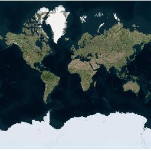
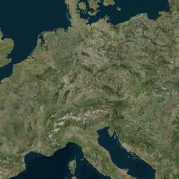

<Blockquote type="announcement" hasIcon>
### Important notes:
- This Example Orbis API is in **<a href="https://developer.Example.com/public-preview">public preview</a>**.
- This API is powered by **Example Orbis Maps.**
- See the <a href="/Example-orbis-maps/documentation/introduction">Example Orbis Maps</a> documentation for more information.
</Blockquote>

## Purpose  

The Maps Raster Satellite Tile API endpoint provides satellite map data that is divided into gridded sections called tiles. Tiles are square images with a size of:  **256 x 256 pixels**. The tiles are available at 20 different zoom levels, ranging from 0 to 19. For zoom level 0, the entire earth is displayed on one single tile, while at zoom level 19, the world is divided into 2<sup>38</sup> tiles. See the:  [Zoom Levels and Tile Grid](/map-display-api/documentation/zoom-levels-and-tile-grid).  

### Data Source  

Satellite imagery data comes from  [Maxar](https://www.maxar.com/products/satellite-imagery)  Satellite Imagery for all supported zoom levels. Most of the detailed imagery for urban areas was captured in or after 2021.  

### Tile image format  

The Maps Raster Tile API Satellite service supports the  **jpg**  format.  

### Overlay  

The overlay can be applied to the Maps Raster Satellite Tiles using the [Assets API](https://developer.Example.com/assets-api/documentation/Example-orbis-maps/product-information/introduction).  

### Tile Sizes  

The following tiles size is currently supported:  

- **256 x 256 pixels**  

## Request data  

### HTTPS method: `GET`  

- Constants and parameters enclosed in curly brackets &#123; &#125; **must be replaced** with their values.
- Please see the following [Request parameters](#request-parameters) section with the required and optional parameters tables for their values. The generic request format is as follows.  

<h4 style={{ fontSize: '1em' }}>URL format</h4>  

```shell [type=get] [title=Request URL]
https://{baseURL}/maps/orbis/map-display/tile/satellite/{zoom}/{X}/{Y}.{format}?key={Your_API_Key}&apiVersion=1
```

<h4 style={{ fontSize: '1em' }}>curl command format</h4>

```shell [type=get] [title=Request curl command]
curl 'https://{baseURL}/maps/orbis/map-display/tile/satellite/{zoom}/{X}/{Y}.{format}?key={Your_API_Key}&apiVersion=1'
```

### Request parameters  

These parameters are used in calls to generate all tile layers.

- Required parameters **must be used** or the call will fail.
- Parameters and values are case-sensitive.
- Optional parameters may be used.

<table data-notbreakword>
  <thead>
    <tr>
      <th colspan="2" style={{ fontSize: '1em' }}>Required parameters</th>
    </tr>
    <tr>
      <th scope="col" style={{ fontSize: '1em' }}>Parameter</th>
      <th scope="col" style={{ fontSize: '1em' }}>Description</th>
    </tr>
  </thead>
  <tbody>
    <tr>
      <th scope="row">
        `baseURL`  
        *string* 
      </th>
      <td>
        The base URL for calling Example services.  
        **Value:** `api.Example.com` 
      </td>
    </tr>
    <tr>
      <th scope="row">
        `layer`  
        *string* 
      </th>
      <td>
        Layer of the tile to be requested.  
        **Value:** `satellite`
      </td>
    </tr>
    <tr>
      <th scope="row">
        `zoom`  
        *integer* 
      </th>
      <td>
        Zoom level of the tile to be rendered.  
        **Value:** `0..19` 
      </td>
    </tr>
    <tr>
      <th scope="row">
        `X`  
        *integer* 
      </th>
      <td>
        The x coordinate of the tile on a zoom grid.  
        **Value:** 0..2  <sup>zoom</sup> -1
      </td>
    </tr>
    <tr>
      <th scope="row">
        `Y`  
        *integer* 
      </th>
      <td>
        The y coordinate of the tile on a zoom grid.  
        **Value:** 0..2  <sup>zoom</sup> -1
      </td>
    </tr>
    <tr>
      <th scope="row">
        `format`  
        *string* 
      </th>
      <td>
        The format of the response.  
        **Value:** `jpg` 
      </td>
    </tr>
    <tr>
      <th scope="row">
        `key`
        *string* 
      </th>
      <td>
        An API Key valid for the requested service.  
        **Value:**  Your valid  `API Key`.
      </td>
    </tr>
  </tbody>
</table>  

<table data-notbreakword>
    <thead>
    <tr>
        <th scope="col" style={{ fontSize: '1em' }}>Optional&nbsp;parameters</th>
        <th scope="col" style={{ fontSize: '1em' }}>Description</th>
    </tr>
    </thead>
    <tbody>
    <tr>
        <th scope="row">
            `apiVersion`  
            *integer*
        </th>
        <td>
            A version of the api to call. If the parameter is set, it will overwrite the value stored in the Example-Api-Version header.  
            **Value:** The current version is `1`.
        </td>
    </tr>
    <tr>
        <th scope="row">
            `style`  
            *string*
        </th>
        <td>
            Style of the tile to be requested.  
            **Value:** `main`
        </td>
    </tr>
  </tbody>
</table>  

### Request headers  

The following table lists HTTP request headers of particular interest to clients of the Maps Raster Tile API Satellite endpoint.

<table data-notbreakword>
  <thead>
    <tr>
      <th scope="col" style={{ fontSize: '1em' }}>Optional&nbsp;headers</th>
      <th scope="col" style={{ fontSize: '1em' }}>Description</th>
    </tr>
  </thead>
  <tbody>
    <tr>
      <th scope="row">[Accept-Encoding](https://developer.mozilla.org/en-US/docs/Web/HTTP/Headers/Accept-Encoding)</th>
      <td>
        Contains the content encoding (usually a compression algorithm), that
        the client is able to understand.  
        **Value:** `gzip` 
      </td>
    </tr>
    <tr>
      <th scope="row">[If-None-Match](https://developer.mozilla.org/en-US/docs/Web/HTTP/Headers/If-None-Match)</th>
      <td>
        Contains an identifier for a specific version of resource. The server
        will send back the requested resource, with a 200 HTTP status code, only
        if it doesn't have an ETag matching the given one.  
        **Value:** `<string>` 
      </td>
    </tr>
    <tr>
      <th id="trackingid-request" scope="row">Tracking-ID</th>
      <td>
        Specifies an identifier for the request. It can be used to trace a call.
        <ul>
          <li>The value must match the regular expression `'^[a-zA-Z0-9-]{1,100}'`.</li>
          <li>An example of the format that matches this regular expression is a UUID (e.g., `9ac68072-c7a4-11e8-a8d5-f2801f1b9fd1`).</li>
          <li>For details check [RFC 4122](https://tools.ietf.org/html/rfc4122).</li>
          <li>If specified, it is replicated in the [Tracking-ID](#trackingid-response)  response header.</li>
        </ul>  
        **Value:** `<string>` 
      </td>
    </tr>
    <tr>
        <th scope="row">
          `Example-Api-Version`                                                      
          *integer*
        </th>
        <td>
            Contains a version of the API to call.  
            **Value:** The current version is `1`.
        </td>
    </tr>
  </tbody>
</table>  

## Response data   

The Maps Raster Tile API Satellite, for a single request, _returns one square tile_ in **jpg** format.  

### Response examples  

<h4 style={{ fontSize: '1em', marginTop: '1em' }}>Example 1: Whole world at zoom = `0`</h4>

<table data-notbreakword style={{ marginTop: '1em' }}>
  <thead>
    <tr>
      <th scope="col">Request (Zoom =  `0` )</th>
      <th scope="col">Response (Zoom =  `0` )</th>
    </tr>
  </thead>
  <tbody>
    <tr>
      <th scope="row">`https://api.Example.com/maps/orbis/map-display/tile/satellite/0/0/0.jpg?key={Your_API_Key}`</th>
      <td>
        
      </td>
    </tr>
  </tbody>
</table>   

<h4 style={{ fontSize: '1em', marginTop: '1em' }}>Example 2: Europe at zoom =  `4`</h4>   

<table data-notbreakword style={{ marginTop: '1em' }}>
  <thead>
    <tr>
      <th scope="col">Request (Zoom =  `4` )</th>
      <th scope="col">Response (Zoom =  `4` )</th>
    </tr>
  </thead>
  <tbody>
    <tr>
      <th scope="row">`https://api.Example.com/maps/orbis/map-display/tile/satellite/4/8/5.jpg?key={Your_API_Key}`</th>
      <td>
        
      </td>
    </tr>
  </tbody>
</table>  

<h4 style={{ fontSize: '1em', marginTop: '1em' }}>Example 3: Amsterdam at zoom =  `17`</h4>  

<table data-notbreakword style={{ marginTop: '1em' }}>
  <thead>
    <tr>
      <th scope="col">Request (Zoom =  `17`)</th>
      <th scope="col">Response (Zoom =  `17`)</th>
    </tr>
  </thead>                                                                
  <tbody>
    <tr>
      <th scope="row">`https://api.Example.com/maps/orbis/map-display/tile/satellite/17/67296/43062.jpg?key={Your_API_Key}`</th>
      <td>
        
      </td>
    </tr>
  </tbody>
</table>  

### Error response  

The Maps Raster Tile API Satellite service for an invalid request returns a response body in XML or JSON format. The XML format is returned by default. To have an error response returned in JSON format,  `application/json`  has to be specified in the  `Accept`  HTTP request header.  

<h4 style={{ fontSize: '1em' }}>Error response field structure</h4>  

<table data-notbreakword>
  <thead>
    <tr>
      <th scope="col" style={{ fontSize: '1em' }}>Field</th>
      <th scope="col" style={{ fontSize: '1em' }}>Description</th>
    </tr>
  </thead>
  <tbody>
    <tr>
      <th scope="row">
        `detailedError`  
        *object* 
      </th>
      <td>Main object of the error response.</td>
    </tr>
    <tr>
      <th scope="row">
        `code`  
        *string* 
      </th>
      <td>One of a server-defined set of error codes.</td>
    </tr>
    <tr>
      <th scope="row">
        `message`  
        *string* 
      </th>
      <td>A human-readable description of the error code.</td>
    </tr>
  </tbody>
</table>  

### Error response example  

```json [title=Error response example - JSON]
{
  "detailedError": {
    "code": "BAD_REQUEST",
    "message": "Invalid tile position arguments"
  }
}
```

```xml [title=Error response example - XML]
<errorResponse description="Invalid tile position arguments" errorCode="400" version="1.0.54-mascoma">
    <code>BAD_REQUEST</code>
    <message>Invalid tile position arguments</message>
  </detailedError>
</errorResponse>
```

### Response codes  

<table data-notbreakword>
  <thead>
    <tr>
      <th scope="col" style={{ textAlign: 'center', fontSize: '1em' }}>Code</th>
      <th scope="col" style={{ fontSize: '1em' }}>Meaning &amp; possible causes</th>
    </tr>
  </thead>
  <tbody>
    <tr>
      <th scope="row" style={{ textAlign: 'center' }}>`200`</th>
      <td>
         **OK** 
      </td>
    </tr>
    <tr>
      <th scope="row" style={{ textAlign: 'center' }}>`304`</th>
      <td>
        **Not Modified**: The tile has not been modified. This code is
        returned when the  `If-None-Match`  request header is used and
        its value matches the ETag of the requested tile.
      </td>
    </tr>
    <tr>
      <th scope="row" style={{ textAlign: 'center' }}>`400`</th>
      <td>
         **Bad request**: Probably malformed syntax.
        <ul>
          <li>Invalid format value.</li>
          <li>
            Zoom  *n*  is out of range 0 &lt;= zoom &lt;= 19: The requested
            zoom level is out of the possible range.
          </li>
          <li>
            x  *n*  is out of range [0, *m* ]: The requested x coordinate
            is out of the possible range (the value of  *m*  will vary
            depending on the zoom level).
          </li>
          <li>
            y  *n*  is out of range [0, *m* ]: The requested y coordinate
            is out of the possible range (the value of  *m*  will vary
            depending on the zoom level).
          </li>
        </ul>
      </td>
    </tr>
    <tr>
      <th scope="row" style={{ textAlign: 'center' }}>`403`</th>
      <td>
         **Forbidden**: The supplied API Key is not valid for this request.
      </td>
    </tr>
    <tr>
      <th scope="row" style={{ textAlign: 'center' }}>`429`</th>
      <td>
        **Too Many Requests**: Too many requests were sent in a given amount
        of time for the supplied API Key.
      </td>
    </tr>
    <tr>
      <th scope="row" style={{ textAlign: 'center' }}>`500`</th>
      <td>
        **Internal Server Error** : There is a problem with the Example Maps Satellite Tile API service.
      </td>
    </tr>
    <tr>
      <th scope="row" style={{ textAlign: 'center' }}>`503`</th>
      <td>
         **Service is currently unavailable**
      </td>
    </tr>
  </tbody>
</table>  

### HTTP response headers  

The following table lists HTTP response headers of particular interest to clients of the Maps Raster Tile API satellite endpoint.  

<table data-notbreakword>
  <thead>
    <tr>
      <th scope="col" style={{ fontSize: '1em' }}>Header</th>
      <th scope="col" style={{ fontSize: '1em' }}>Description</th>
    </tr>
  </thead>
  <tbody>
    <tr>
      <th scope="row">[Access-Control-Allow-Origin](https://developer.mozilla.org/en/docs/HTTP/Access_control_CORS#Access-Control-Allow-Origin)</th>
      <td>
        The Maps Raster Tile API allows cross-origin resource sharing (CORS).  
        **Value:** ` * ` 
      </td>
    </tr>
    <tr>
      <th scope="row">[Cache-Control](https://developer.mozilla.org/en-US/docs/Web/HTTP/Headers/Cache-Control)</th>
      <td>
        Contains directives for a caching mechanism.  
        **Value:** `max-age=<decimal number>` 
      </td>
    </tr>
    <tr>
      <th scope="row">[Content-Encoding](https://developer.mozilla.org/en-US/docs/Web/HTTP/Headers/Content-Encoding)</th>
      <td>
        Indicates which encodings were applied to the response body.  
        **Value:** `gzip` 
      </td>
    </tr>
    <tr>
      <th scope="row">[Content-Length](https://developer.mozilla.org/en-US/docs/Web/HTTP/Headers/Content-Length)</th>
      <td>
        Contains information about the size of the response body.  
        **Value:** `<decimal number>` 
      </td>
    </tr>
    <tr>
      <th scope="row">[Content-Type](https://developer.mozilla.org/en-US/docs/Web/HTTP/Headers/Content-Type)</th>
      <td>
        Indicates the media type of the resource returned.  
        **Value:** `image/jpg` 
      </td>
    </tr>
    <tr>
      <th scope="row">[Date](https://developer.mozilla.org/en-US/docs/Web/HTTP/Headers/Date)</th>
      <td>
        Contains the date and time at which the message was originated.  
        **Value:** `<http-date>` 
      </td>
    </tr>
    <tr>
      <th scope="row">[ETag](https://developer.mozilla.org/en-US/docs/Web/HTTP/Headers/ETag)</th>
      <td>
        Contains an identifier for a specific version of resource.  
        **Value:** `"<hexadecimal number>"`
      </td>
    </tr>
    <tr>
      <th scope="row">[Expires](https://developer.mozilla.org/en/docs/Web/HTTP/Headers/Expires)</th>
      <td>
        Contains the date after which the response is considered outdated.  
        **Value:** `http-date` 
      </td>
    </tr>
    <tr>
      <th scope="row">[Transfer-Encoding](https://developer.mozilla.org/en-US/docs/Web/HTTP/Headers/Transfer-Encoding)</th>
      <td>
        Specifies the form of encoding used to safely transfer the response to
        the user. If this header is specified, Content-Length header will be
        absent.  
        **Value:** `chunked` 
      </td>
    </tr>
    <tr>
      <th id="trackingid-response" scope="row">Tracking-ID</th>
      <td>
        An identifier for the request. If the [Tracking-ID](#trackingid-request)  header was specified in
        the request, it is replicated in the response. Otherwise, it is automatically generated by the service. 
        For details check [RFC 4122](https://tools.ietf.org/html/rfc4122).  
         *Value:** `<string>` 
      </td>
    </tr>
  </tbody>
</table>  
